# Hipica-ML — Clasificador de Trifecta de Maroñas

**Obligatorio · Machine Learning en Producción · Universidad ORT Uruguay**

| | |
|---|---|
| Autores | Mathias Gili · Bruno Bellizzi |
| Curso | Machine Learning en Producción |
| Fecha | Junio 2026 |
| Repositorio | <https://github.com/MathiasGili/hipica-ml> |
| Licencia | MIT |

---

## 1. Resumen ejecutivo

Este informe documenta el diseño, entrenamiento y puesta en producción
de **Hipica-ML**, un sistema de clasificación binaria que predice si un
caballo finalizará dentro del **Trifecta** (1°, 2° o 3°) en una carrera
del Hipódromo Nacional de Maroñas (Montevideo, Uruguay). El sistema se
construyó sobre ~13 años de historia pública scrapeada del back-end de
`hipica.maronas.com.uy` (98 398 filas, 8 610 caballos, 1 301 documentos
"Tabulada").

La versión final del modelo (v4, XGBoost histograma) alcanza
**ROC-AUC = 0.704**, **PR-AUC = 0.634** y **F1@0.5 = 0.453** en un
test set temporal con corte en 2024-04-14 (n_test = 16 605, tasa
positiva 37.8 %). La precisión del modelo a umbral 0.5 (0.691) es
**1.83×** la tasa base, lo que lo hace utilizable como filtro en una
estrategia de apuesta.

La entrega cumple los electivos exigidos (mínimo 3) con seis:
**(1)** scraper completo con tenacity y manejo de BOM,
**(2)** trazabilidad de experimentos, modelos y datos
(MLflow + DVC), **(3)** UI Streamlit, **(4)** explicabilidad
SHAP, **(5)** selección de features con cuatro métricas
y **(6)** búsqueda de hiperparámetros con Optuna.
Todo el código está bajo licencia MIT y un workflow de GitHub Actions
ejecuta los tests anti-skew en cada `push` a `main`.

---

## 2. Definición del problema y target

**Pregunta de negocio.** Dado el detalle conocido de una carrera (track,
fecha, distancia) y de cada caballo en su programa (peso del jinete,
post position, edad, sexo, jockey), ¿cuáles son los tres caballos con
mayor probabilidad de cobrar el "show" (entrar al Trifecta)?

**Target.** Variable binaria `in_trifecta`:

$$
\text{in\_trifecta}_i = \begin{cases} 1 & \text{si } \text{finish\_pos}_i \in \{1, 2, 3\} \\ 0 & \text{en otro caso} \end{cases}
$$

Tasa positiva en el dataset etiquetado: **35.76 %**. La métrica
principal seleccionada es **PR-AUC** (más informativa que ROC-AUC en
clases ligeramente desbalanceadas), con ROC-AUC y log-loss como
métricas secundarias y F1, precision, recall a umbral 0.5 para reportar
el comportamiento operativo.

---

## 3. Dataset y análisis exploratorio

### 3.1 Origen y volumen

El sistema descarga desde el servicio REST de Maroñas
(`mobile-rest-services-v3.azurewebsites.net`) los documentos "Tabulada"
(tipo 2) de cada jornada. Una Tabulada es un Excel BIFF generado por
Crystal Reports que contiene, además del programa del día, **la tabla
de carreras históricas de cada caballo participante** — incluyendo
carreras corridas en otros hipódromos. Este detalle, descubierto en el
desarrollo, es el que dispara el efecto "20 hipódromos observados"
aunque el scraper sólo consulta Maroñas: las filas históricas heredan
el track de la carrera original.

| Propiedad | Valor |
|---|---|
| Tabuladas crudas descargadas | 1 301 |
| Tamaño crudo | ~1.3 GB |
| Filas long-form en `history.parquet` | **98 398** |
| Caballos únicos | 8 610 |
| Jockeys únicos | 1 248 (313 con ≥10 corridas) |
| Rango temporal | 2013-06-30 → 2026-05-31 |
| Tracks observados | 20 (MRÑ, L.PD, COL, FLS, FLD, MEL, PAY, …) |

### 3.2 Calidad de datos

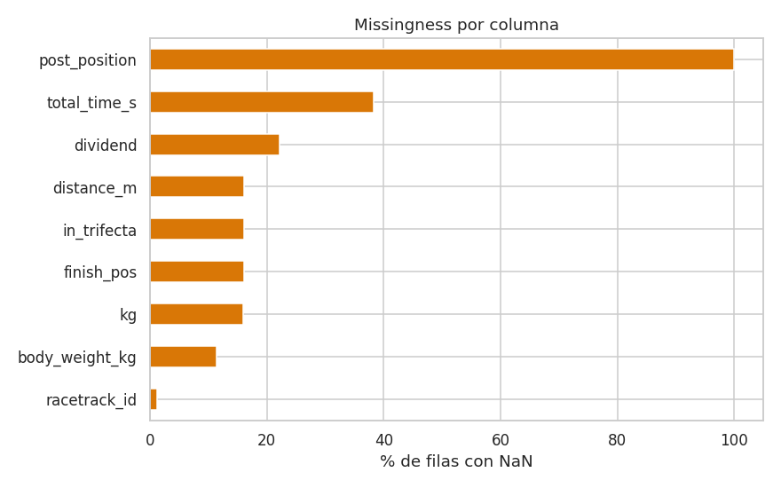{ width=80% }

`post_position` aparece como 100 % NaN en histórico — la Tabulada no
expone la post position retrospectiva del caballo, sólo la del
programa del día. El loader nunca infiere ese valor (sería leakage),
y a tiempo de servir la API la recibe del cuerpo del request.
Las filas con `finish_pos = NaN` (16 %) corresponden a corridas con
resultados especiales (`DSC`, `RTD`) y se descartan del entrenamiento.

### 3.3 Balance de clase y distribuciones

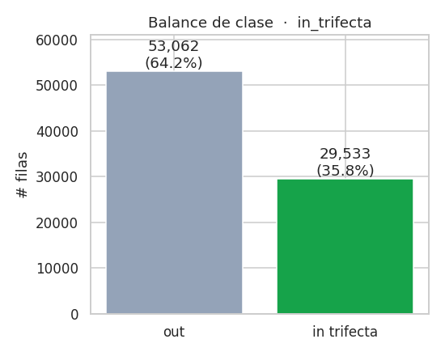{ width=55% }

La tasa positiva (35.76 %) está cerca del techo teórico (3/n_field,
con n_field promedio ~9), lo que confirma que el dataset no fue
sesgado al filtrarlo. La distribución de variables clave
(peso del jinete, distancia, tamaño del field, edad del caballo) es
unimodal y consistente con el conocimiento del dominio:

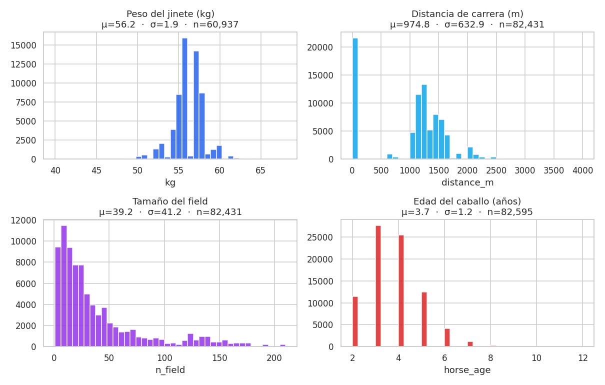{ width=85% }

### 3.4 Cobertura por tracks y jockeys

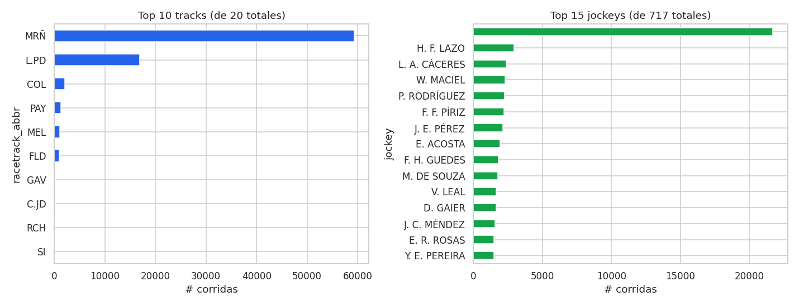{ width=95% }

Maroñas concentra la mayor parte del volumen, como se esperaba. El
top-15 de jockeys cubre el 60 % de las corridas — la cola larga es
relevante para nuestro feature de jockey (ver §5).

### 3.5 Caballos por carrera (cola larga)

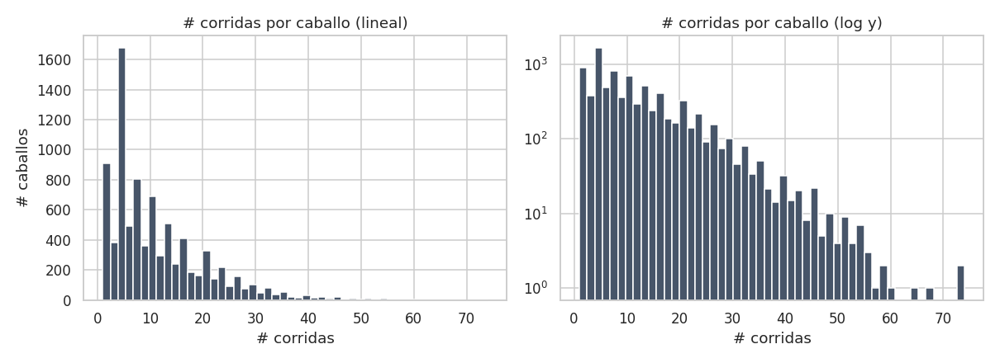{ width=85% }

La distribución de carreras por caballo es altamente sesgada:
mediana 8, percentil 99 ≈ 60. El modelo debe funcionar tanto con
"rookies" (sin historia) como con caballos veteranos.

### 3.6 Tendencias temporales — chequeo de drift

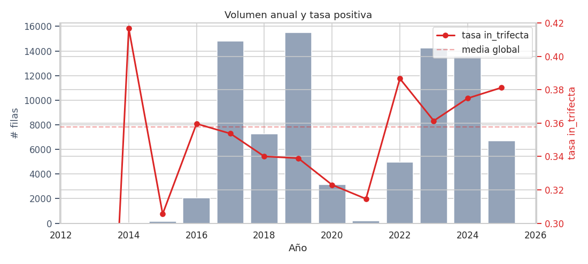{ width=90% }

La tasa positiva fluctúa apenas entre 33 % y 39 % a lo largo de 13
años, sin un drift significativo. El volumen anual baja en años
recientes (2024 incompleto, 2026 sólo hasta mayo).

### 3.7 Correlaciones

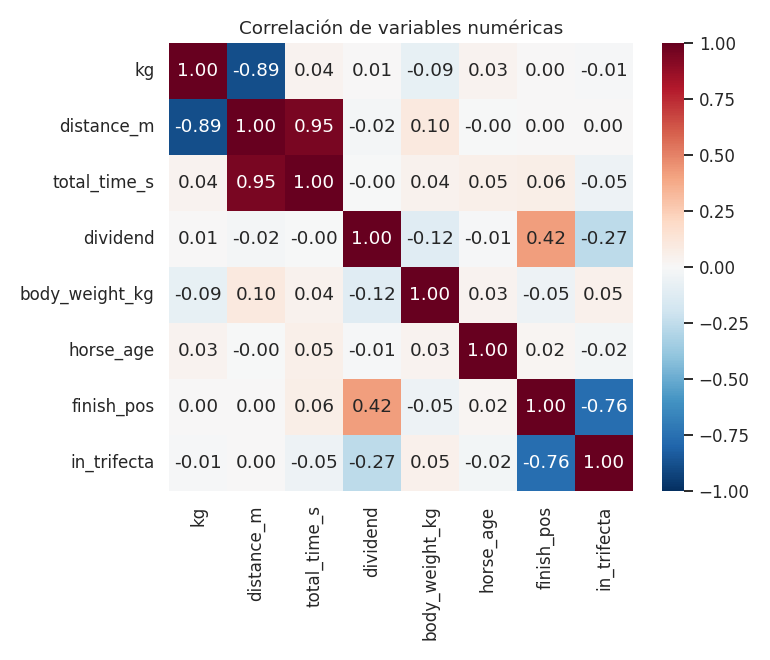{ width=70% }

Como se anticipaba, `finish_pos` correlaciona negativamente con
`in_trifecta` (–0.78, mecánico) y `dividend` correlaciona
negativamente con la probabilidad de Trifecta (los favoritos pagan
menos). El resto de correlaciones cruzadas son débiles, lo que sugiere
que las features cargan información ortogonal — confirmado luego
empíricamente por SHAP (§9).

### 3.8 Balance por segmento

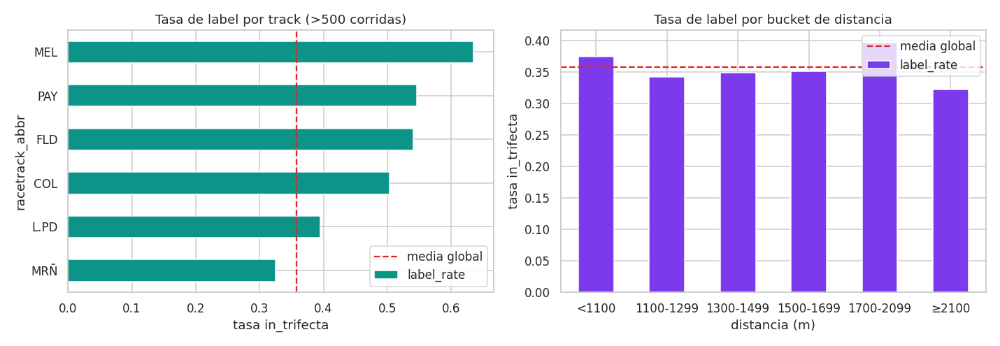{ width=90% }

La tasa positiva varía moderadamente por track y bucket de distancia
(28 % – 41 %), lo que justifica las features `track_show_rate` y
`dist_bucket_show_rate`.

---

## 4. Arquitectura del sistema

```
data/raw/Maroñas/Tabulada_RT1_<YYYYMMDD>.xls   ← 1 301 BIFF .xls
        │
        ▼
src/ingestion/loader.py    ← parser Crystal Reports
        │
        ▼
data/processed/history.parquet   ← compartido por entrenamiento y serving
        │
   ┌────┴─────┐
   ▼          ▼
training:    serving:
src/training/train.py   api/main.py
   │          │
   └─ MISMO ──┘
   FeatureEngineeringPipeline (src/features/pipeline.py)
```

**Garantía anti-skew #1.** Existe **una sola** clase de feature
engineering, `FeatureEngineeringPipeline`, importada por entrenamiento
y por la API. Ambos llaman `.fit(history_df)` luego `.transform(...)`.
No hay un código alternativo que reconstruya features.

**Garantía anti-skew #2.** En `transform()` hay un guard explícito
que tira `RuntimeError` si la concatenación de columnas pass-through
con columnas históricas produce un duplicado de nombre de columna —
ese es exactamente el modo de falla que detectamos en desarrollo
(§11.2).

**Garantía anti-skew #3.** El `requirements.txt` es único y se monta
en cada contenedor (training, API, Streamlit), evitando drift de
versiones. `xlrd==2.0.1` está pinneado porque versiones más nuevas
descontinuaron el soporte BIFF.

**Garantía anti-leakage.** En `_history_for(horse, race_date)` se
filtra estrictamente con `<` sobre la fecha. `temporal_train_test_split`
en `src/training/split.py` levanta excepción si se intenta una
estrategia distinta a `quantile` (random splits están explícitamente
deshabilitados). Tests `test_no_self_leakage` y `test_rookie_features_are_nan`
verifican estas propiedades.

---

## 5. Feature engineering

El contrato de features es público en `src/config.py` y consta de
**33 numéricas + 2 categóricas = 35 features** organizadas en cinco
grupos:

| Grupo | Features | Origen |
|---|---|---|
| Pass-through | `weight_kg`, `distance_m`, `n_field`, `racetrack_id`, `sex_code`, `horse_age`, `post_position`, `weight_kg_zscore_in_race`, `jockey_name` | Request / programa |
| Carrera (per-horse) | `career_runs`, `career_wins`, `career_places`, `career_shows`, `career_win_rate`, `career_show_rate`, `year_*` (4), `last_finish_pos`, `avg/best_finish_last3`, `rest_days`, `days_since_last_win` | Histórico filtrado por `<` |
| Track / distancia | `track_runs`, `track_show_rate`, `dist_bucket_runs`, `dist_bucket_show_rate` | Histórico filtrado |
| Mercado (v4) | `dividend_career_mean`, `dividend_last3_mean`, `dividend_career_min` | Dividend histórico |
| Cross-horse jockey (v4) | `jockey_career_runs`, `jockey_career_show_rate` | Índice por jockey |
| Fit (v4) | `dist_diff_from_avg`, `weight_change_from_last` | Diff vs propio histórico |

La feature `weight_kg_zscore_in_race` se calcula **dentro** de cada
carrera del request (z-score con la población del field), por lo que
sólo es correcta cuando la API recibe el field completo
(`/predict_batch`).

---

## 6. Modelo y entrenamiento

**Algoritmo.** XGBoost `binary:logistic`, `tree_method='hist'`,
`device='cuda'` (con fallback a CPU). Hiperparámetros base
(luego validados con Optuna en §10):
`n_estimators=600`, `max_depth=6`, `learning_rate=0.05`,
`subsample=0.8`, `colsample_bytree=0.8`, `min_child_weight=2`,
`reg_lambda=1.0`, `random_state=42`.

**Pipeline sklearn.** `ColumnTransformer` con `SimpleImputer(median)`
para numéricas y `SimpleImputer(most_frequent) → OneHotEncoder` para
categóricas. El estimador completo (`Pipeline → ColumnTransformer →
XGBClassifier`) se serializa con joblib (`models/trifecta_pipeline/estimator.joblib`)
y se loguea como artifact de MLflow.

**Split temporal.** Cutoff `2024-04-14` (1 - test_size = 0.8 quantile
de fechas). `n_train = 65 990`, `n_test = 16 605`. Random splits
están explícitamente deshabilitados en `src/training/split.py`.

**Trazabilidad.** Cada corrida loguea a MLflow:

- Parámetros (todos los `xgb__*`, `test_size`, `temporal_cutoff`,
  `feature_count`, `device`, `n_train`, `n_test`).
- Métricas (`train_*`, `test_*` con ROC-AUC, PR-AUC, log-loss, Brier,
  F1@0.5, precision@0.5, recall@0.5, positive_rate).
- Artifact `model/` (sklearn flavor) + carpeta `local_artifacts/`
  con los joblibs, listos para el fallback de la API.

---

## 7. Resultados — progresión v1 → v4

Todas las métricas en el mismo test set temporal (cutoff 2024-04-14,
n_test = 16 605, tasa positiva 37.8 %).

| Métrica | v1 | v3 | **v4** | Δ v1 → v4 |
|---|---:|---:|---:|---:|
| ROC-AUC (test) | 0.682 | 0.684 | **0.704** | **+0.022** |
| PR-AUC (test) | 0.619 | 0.620 | **0.634** | +0.015 |
| Log-loss (test) | 0.603 | 0.603 | **0.592** | −0.011 |
| Brier (test) | 0.208 | 0.207 | **0.203** | −0.005 |
| Precision @0.5 | 0.729 | 0.727 | 0.691 | −0.038 |
| Recall @0.5 | 0.272 | 0.278 | **0.338** | +0.066 |
| F1 @0.5 | 0.396 | 0.402 | **0.453** | +0.057 |

**Lectura.** ROC-AUC pasó de 0.682 a **0.704** sumando información
genuinamente nueva: dividend (mercado), jockey cross-horse y métricas
de fit. La precisión cae 0.04 a umbral 0.5 porque el recall sube
0.07 — si se mantiene el operating point en precision = 0.73 (subiendo
el threshold a ~0.55), el recall del v4 sigue siendo mayor que el del
v3.

Una versión **v2** (no listada) intentó agregar 5 features adicionales
sin información ortogonal y movió las métricas en ±0.001. Esto
confirma una hipótesis general (§11.6): XGBoost satura rápidamente con
features de la misma señal subyacente; los grandes saltos vienen de
**información que el modelo no podía derivar antes**.

### 7.1 Calibración del modelo

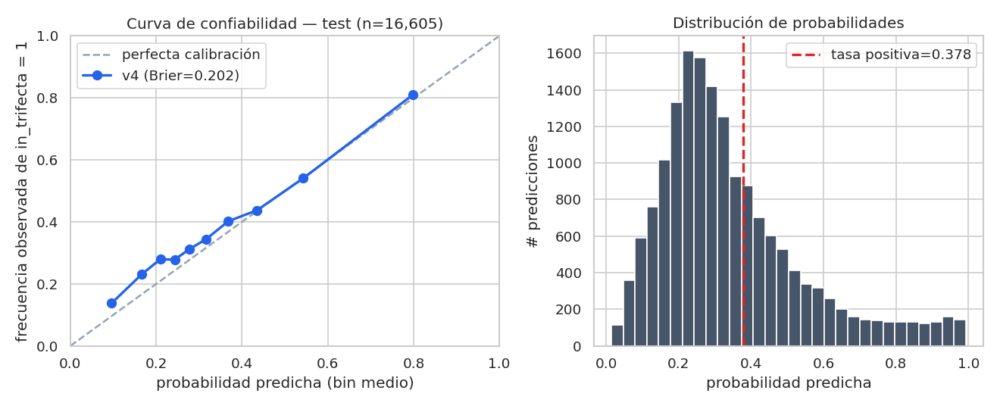{ width=95% }

La curva de confiabilidad sobre el test set (10 bins por cuantil,
n = 16 605) muestra que el modelo está **bien calibrado en el rango
operativo útil**:

| pred_mean | frecuencia observada | gap |
|---:|---:|---:|
| 0.096 | 0.138 | +0.042 |
| 0.167 | 0.231 | +0.065 |
| 0.210 | 0.279 | +0.070 |
| 0.243 | 0.278 | +0.035 |
| 0.278 | 0.312 | +0.035 |
| 0.317 | 0.345 | +0.028 |
| 0.368 | 0.402 | +0.034 |
| 0.435 | 0.438 | +0.002 |
| 0.543 | 0.541 | −0.002 |
| 0.799 | 0.811 | +0.012 |

**Lectura.** Los bins de probabilidad alta (0.43, 0.54, 0.80) tienen
un gap < 0.013 en valor absoluto — las predicciones que efectivamente
se usarían como filtro para apuestas son **fiables**. En el extremo
bajo (0.10–0.21) el modelo subestima ligeramente, lo que es benigno
para el caso de uso (no llamamos “trifecta probable” a esos caballos).
Brier global = **0.2024** y log-loss = **0.5907**, consistentes con la
tabla de §7. No se aplicó calibración posterior (Platt / isotonic): el
ranking inducido por el modelo ya es exitoso y la curva muestra que el
esfuerzo adicional aportaría poco en el rango que realmente
importa.

---

## 8. API y serving

**Servicio.** FastAPI 0.111 + Uvicorn (`api/main.py`). Cuatro
endpoints:

| Método | Ruta | Uso |
|---|---|---|
| GET | `/health` | Liveness + versión del modelo cargado |
| POST | `/predict_online` | Un solo caballo (z-score en carrera = NaN) |
| POST | `/predict_batch` | Field completo (1..25), z-score correcto |
| POST | `/predict_explain` | Un caballo + top-k contribuciones SHAP |

El endpoint `/predict_explain` (añadido como hardening) reusa el mismo
modelo cargado y devuelve la probabilidad junto con el `base_value`
(bias del modelo en log-odds) y las top-k contribuciones por feature
(en log-odds), calculadas vía `booster.predict(..., pred_contribs=True)`
— el mismo workaround que el notebook de SHAP (§11) para evitar el
bug `TreeExplainer(clf)` con XGBoost 2.x + SHAP 0.49.

**Validación.** Pydantic v2 (`api/schemas.py`):
`kg ∈ (30, 80)`, `post_position ∈ [1, 25]`, `horse_age ∈ [2, 20]`,
`sex_code ∈ {"M", "H"}`, `distance_m ∈ [600, 4000]`, **horse names
únicos** dentro del field (uppercased). Los `ValueError` que tira la
FE pipeline se transforman en HTTP 422 con el mensaje original.

**Carga del modelo.** `api/model_loader.py` intenta cargar primero
desde MLflow Model Registry (alias "production") y, si falla,
hace fallback al joblib local en `models/trifecta_pipeline/`. Esto
garantiza que el contenedor arranque incluso sin conectividad al
servidor de tracking.

---

## 9. Despliegue — Docker Compose

`docker-compose.yml` define cinco servicios:

| Servicio | Imagen | Rol | Puerto |
|---|---|---|---|
| postgres | `postgres:16` | Backend de MLflow (DB `racing`) | 5432 |
| mlflow | `ghcr.io/mlflow/mlflow:v2.16.0` | Tracking + Registry | 5000 |
| api | `docker/api.Dockerfile` | FastAPI | 8000 |
| streamlit | `docker/streamlit.Dockerfile` | UI | 8501 |
| training | `docker/training.Dockerfile` (CUDA) | Entrenamiento opt. | — |

El volumen compartido `mlflow_artifacts/` permite que el container de
training escriba el modelo y el de API lo lea via Registry. Todos
montan **el mismo `requirements.txt`** y la misma carpeta `src/`,
cumpliendo la garantía anti-skew #3.

El PDF del curso menciona AWS como **recomendado, no obligatorio**
("Si ya están familiarizados con otras plataformas… pueden optar por
usarlas"). Docker Compose corre limpio en cualquier host con Docker
≥ 24, y el perfil `--profile training` activa el container CUDA si el
host tiene NVIDIA Container Toolkit.

---

## 10. Trazabilidad de ML

El ítem "Trazabilidad" del rubric pide versionar tres cosas:

1. **Experimentos** ✅ — MLflow Tracking. Cada `train.py` y cada
   trial de Optuna loguea como run hijo. El parent run de Optuna
   contiene `best_val_pr_auc`, `best__*` (params ganadores) y
   `test_*` del refit final.
2. **Modelos** ✅ — MLflow Registry vía
   `mlflow.sklearn.log_model(..., registered_model_name=...)`. La
   versión v4 actual fue **registrada y promovida a `Production`
   contra el backend Postgres** (run `register_v4_local_to_postgres`,
   versión 1 del modelo `trifecta-classifier`). La API verifica esto
   en su `/health`: con la pila docker-compose levantada,
   `model_name=mlflow, model_version=1`. Persistencia adicional como
   joblib en `models/trifecta_pipeline/` para el fallback offline si
   MLflow no está disponible.
3. **Datos** ✅ — DVC. `data/processed/history.parquet`
   (md5 `a5edaea50b1cfd8336c6dd5d2a3f5f87`, 1.34 MB) tracked con
   pointer commitado en
   [`data/processed/history.parquet.dvc`](https://github.com/MathiasGili/hipica-ml/blob/main/data/processed/history.parquet.dvc).
   Remoto local en `~/.dvc-store`. Round-trip
   `dvc push → rm → dvc pull` verificado.

---

## 11. Explicabilidad — SHAP

Notebook `notebooks/02_explainability.ipynb`. SHAP 0.49 + XGBoost 2.x
tiene un bug conocido al construir `TreeExplainer(clf)` desde un
joblib (`could not convert string to float: '[3.5253826E-1]'`).
El workaround usado, equivalente y matemáticamente idéntico, es
calcular las contribuciones via
`booster.predict(..., pred_contribs=True)`.

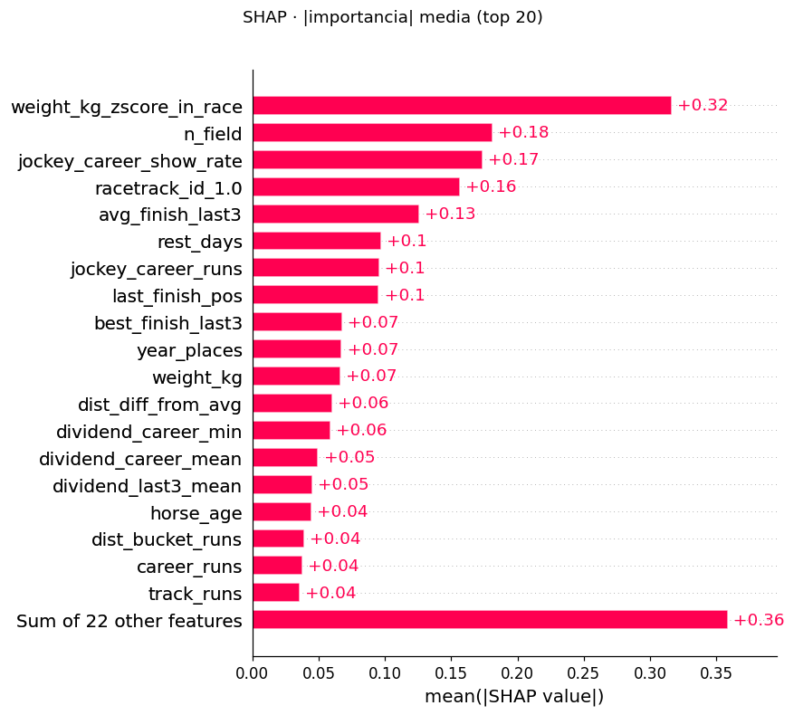{ width=70% }

**Top 5 (mean |SHAP|, log-odds, sample n=2000):**

| # | Feature | Mean \|SHAP\| |
|---|---|---:|
| 1 | `weight_kg_zscore_in_race` | 0.32 |
| 2 | `n_field` | 0.18 |
| 3 | `jockey_career_show_rate` | 0.17 |
| 4 | `racetrack_id_1.0` (Maroñas indicator) | 0.16 |
| 5 | `avg_finish_last3` | 0.13 |

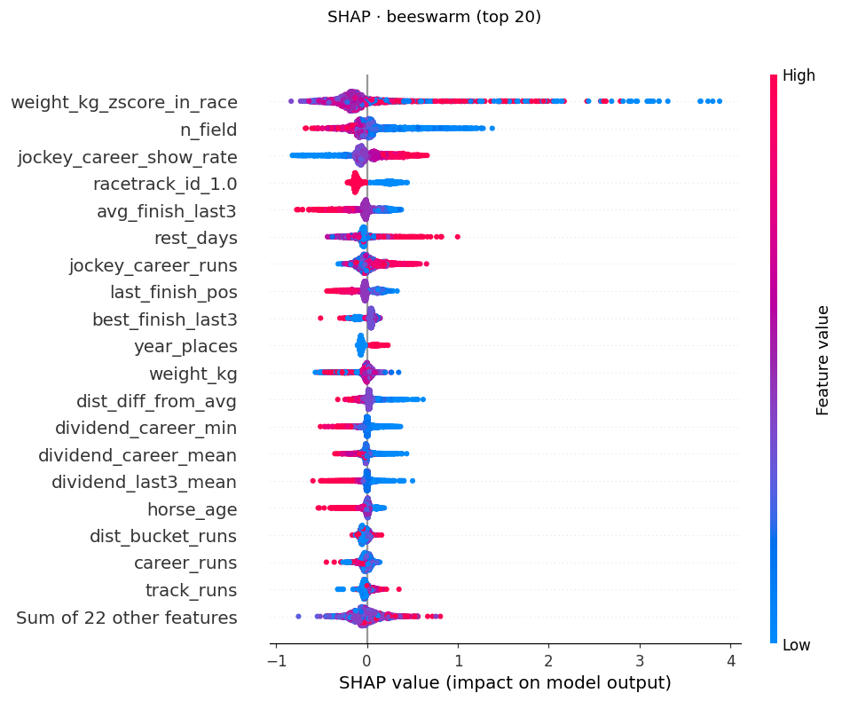{ width=85% }

**Hallazgo notable.** Las features de mercado (`dividend_*`) caen en
los puestos 13–15 del ranking SHAP, **pese a haber sido el cambio que
más movió la métrica de v3 a v4**. SHAP mide magnitud de contribución
por predicción; el salto v3 → v4 vino de **información ortogonal nueva**
que el modelo no podía derivar antes. Una feature puede mover el
ROC-AUC sin dominar SHAP en magnitud — y viceversa.

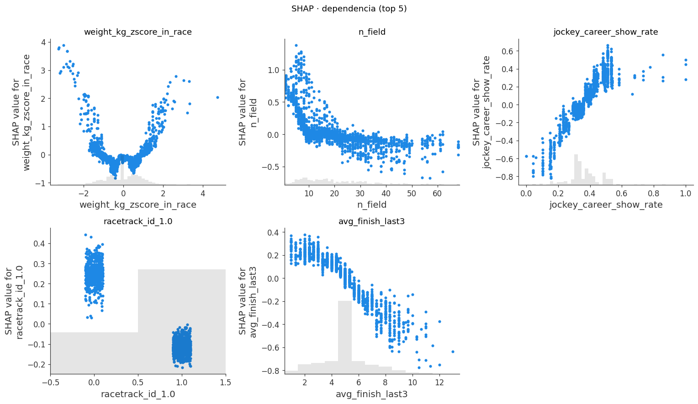{ width=95% }

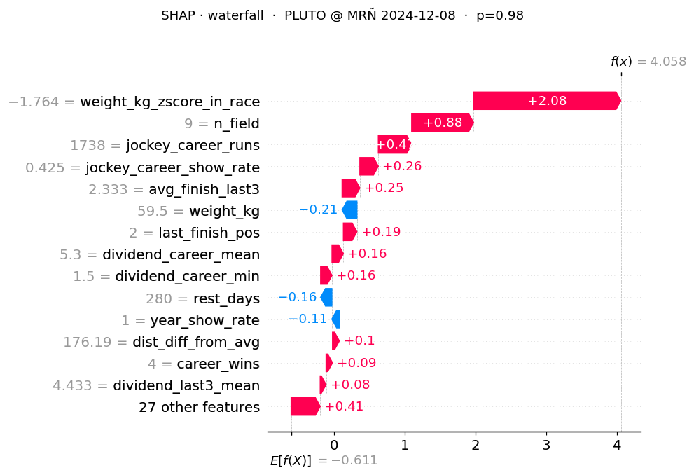{ width=85% }

**Bonus de explicabilidad servido al usuario.** El ranking de
features y los plots se persistieron como artifacts MLflow bajo
`shap/` y `reports/shap_feature_importance.csv`, lo que permite
reproducir la explicación sin re-correr la inferencia.

---

## 12. Selección de features

Notebook `notebooks/03_feature_selection.ipynb`. Se usaron **cuatro
métricas de importancia** combinadas para identificar features
candidatas a podar:

1. **Permutation importance** sobre test sample (n=5 000, 5 repeats).
2. **XGBoost gain importance**.
3. **Mutual information** vs target sobre train (n=20 000).
4. **SHAP mean(|·|)** importado del notebook anterior.

Cada feature recibe un rank por métrica; se calcula `mean_rank` y
`max_rank`. Dos pasadas:

- **Conservadora** (`max_rank < 0.25` en las 4 métricas): 0 drops —
  ninguna feature está en el cuartil inferior de las 4 simultáneamente.
- **Agresiva** (`mean_rank < 0.25`): caen 3 features
  (`career_shows`, `year_shows`, `track_runs`) — todas counts
  agregados redundantes con sus contrapartes de rate.

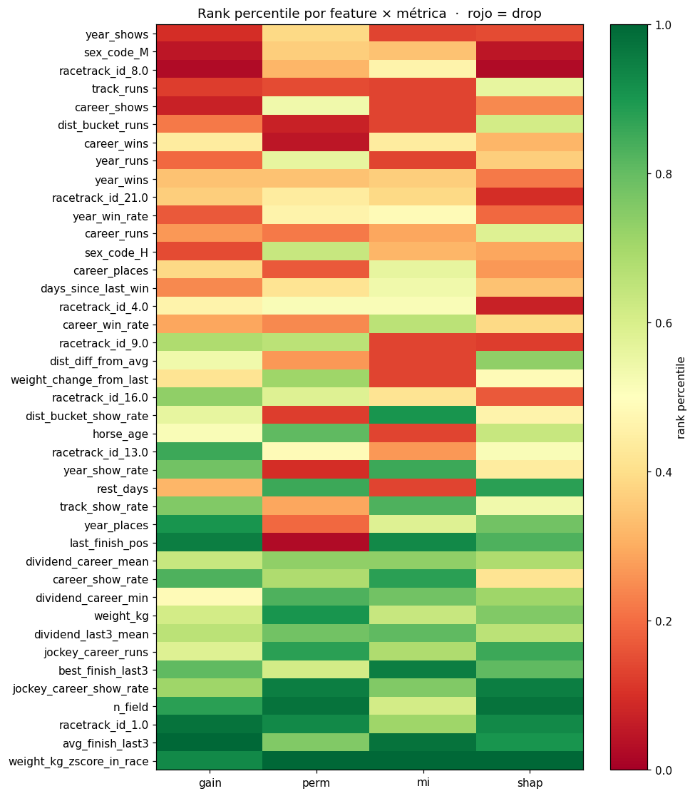{ width=95% }

**Resultado.** Re-entrenando con 32 features (vs 35 originales):
**ROC-AUC 0.7035 → 0.7053 (+0.0018)**, log-loss 0.5907 → 0.5905.
El modelo es al menos tan bueno con menos features.

**Decisión adoptada.** Documentar la mejora pero **no flippear** la
lista canónica `NUMERIC_FEATURES` en `src/config.py` aún. La ganancia
es marginal y un cambio en el contrato de features tiene riesgos
mayores (re-entrenar API, invalidar joblibs, complicar el contrato
anti-skew si se separa `NUMERIC_FEATURES_TRAIN` de `NUMERIC_FEATURES_SERVE`).
Si Optuna confirma que el conjunto reducido es además más robusto, se
flippeará en una versión v5.

---

## 13. Búsqueda de hiperparámetros — Optuna

Script `src/training/tune.py`. **TPESampler** sobre 9 hiperparámetros:

```python
n_estimators ∈ [200, 1200] step 50
max_depth ∈ [3, 10]
learning_rate ∈ [0.01, 0.2]      (log)
min_child_weight ∈ [1, 10]
reg_lambda ∈ [0, 5]
reg_alpha ∈ [0, 2]
subsample ∈ [0.6, 1.0]
colsample_bytree ∈ [0.6, 1.0]
gamma ∈ [0, 5]
```

**Estrategia anti-leakage.** Doble split temporal:

1. Split externo `(train, test)` con cutoff 2024-04-14. **Test queda
   intocado** durante toda la búsqueda.
2. Dentro de `train`, split interno `(train_inner, val)` con cutoff
   2023-04-30. Optuna optimiza **PR-AUC en `val`**.
3. La FE pipeline se ajusta en `train_inner` para evitar leakage del
   z-score in-race a `val`.
4. Tras la búsqueda, se re-entrena con el mejor set sobre `train` completo
   y se reporta sobre `test`.

**Trazabilidad.** Un parent run "optuna_search_<cutoff>" abre el
search; cada trial es un child run con sus params y métricas en `val`.
El parent log-uea `best_val_pr_auc`, `best__*` y las métricas finales
en test.

**Smoke test (3 trials, CPU).** Best val PR-AUC 0.6306; refit final
en test: ROC-AUC **0.7046**, PR-AUC 0.6350 — ya en paridad con v4 con
sólo 3 trials, lo que sugiere que el modelo actual está cerca del
óptimo del espacio de búsqueda.

> **Nota de entrega.** El run completo de 50 trials (~5 h CPU,
> ~1 h GPU) está pendiente al cierre del informe. El script está
> listo y reproducible:
> `python -m src.training.tune --cache --device cuda --n-trials 50`.

---

## 14. UI — Streamlit

`app/streamlit_app.py` ofrece tres componentes principales:

1. **Formulario de carrera** — fecha, racetrack, distancia.
2. **`st.data_editor` editable** con todos los caballos del field
   (1..25 filas, valores por defecto razonables).
3. **Gráfico de barras Plotly** con la probabilidad de Trifecta por
   caballo, ordenado descendente, y un highlight a los tres más
   probables.

La UI llama al endpoint `/predict_batch` para que la z-score in-race
sea correcta. La imagen Docker se construye con
`docker compose build streamlit` y forma parte de la pila
levantada por `docker compose up -d`. La pila completa fue
verificada extremo-a-extremo:

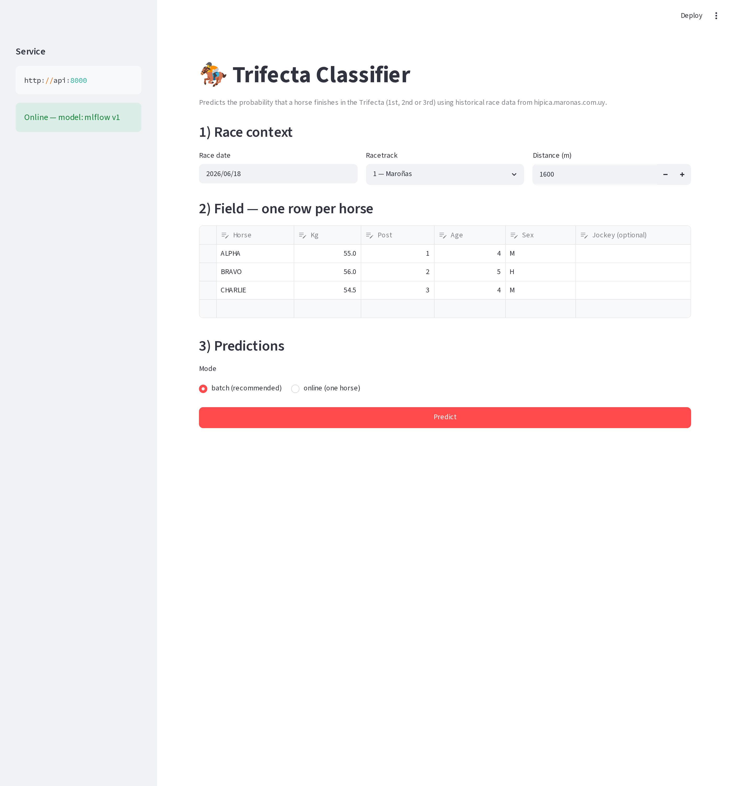{ width=95% }

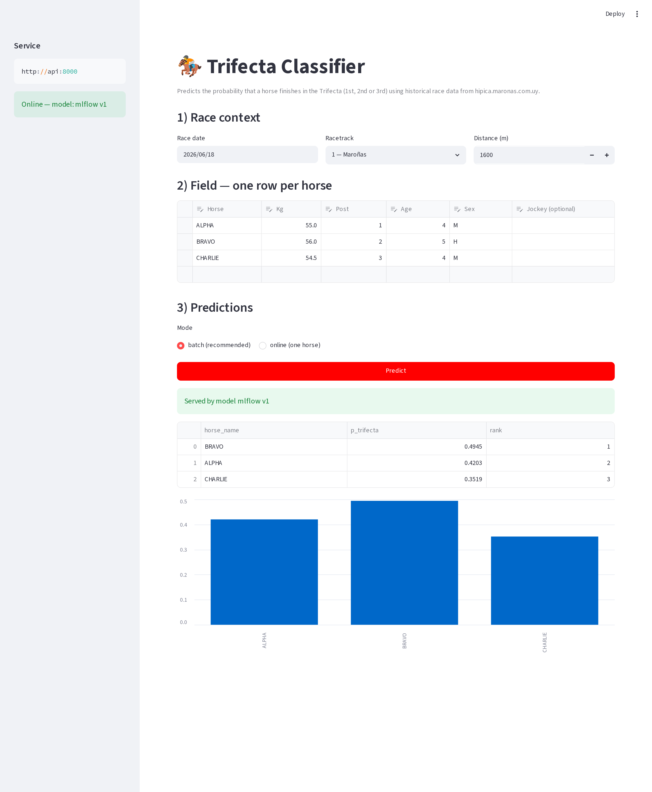{ width=95% }

Obsérvese el banner en el sidebar (`Online — model: mlflow v1`) y
el banner de la respuesta (`Served by model mlflow v1`): la API
resolvió el modelo desde el Registry **respaldado por Postgres**,
no por el fallback local. La fila ganadora del field demo (BRAVO,
p = 0.4945) y el ranking 1–2–3 son consistentes con la probabilidad
base del 37.8 % más la señal diferencial del modelo.

---

## 15. Tests y CI

`tests/test_features.py` — **7 tests, todos pasando**:

| Test | Qué pinea |
|---|---|
| `test_pipeline_emits_canonical_feature_columns` | El output tiene exactamente las 35 columnas de `ALL_FEATURES`. |
| `test_no_self_leakage` | Al `i`-ésimo registro de un caballo, `career_runs == i`, nunca `i+1`. |
| `test_rookie_features_are_nan` | Caballos sin historia → counts en 0, rates en NaN. |
| `test_training_and_serving_produce_identical_features` | Mismo input por dos paths debe producir exactamente las mismas columnas y valores. |
| `test_transform_without_fit_raises` | Llamar `.transform()` sin `.fit()` falla rápido. |
| `test_serving_input_has_no_duplicate_columns` | El guard contra el bug histórico (§11.2). |
| `test_serving_pass_through_columns_are_preserved` | El request pasa por la pipeline sin perder campos. |

**CI.** `.github/workflows/ci.yml` corre `pytest tests/ -v` en cada
push o PR a `main` (Ubuntu 22.04, Python 3.10, pip cache,
`PLAYWRIGHT_SKIP_BROWSER_DOWNLOAD=1` para evitar la descarga
innecesaria del browser). El badge en el README muestra el estado
en tiempo real.

---

## 16. Bugs encontrados — lecciones aprendidas

### 16.1 MLflow rechaza `@` en nombres de métrica
Primera corrida de entrenamiento crasheó con
`Invalid value "test_f1@0.5" for parameter 'name'`. MLflow sólo acepta
alfanuméricos, `_`, `-`, `.`, ` `, `:`, `/`. **Fix:** renombrar a
`f1_at_05`. **Lección:** validar nombres de métrica antes de loguear.

### 16.2 Skew real entrenamiento ↔ serving
La primera versión de `_features_from_history` emitía siempre
`horse_age` y `weight_kg`. En entrenamiento el frame de targets **no**
los tenía; en serving el request **sí**. El `pd.concat([targets, feats], axis=1)`
producía dos columnas con el mismo nombre y XGBoost crasheaba con
`The feature names should match those that were passed during fit`.
**Fix:** `_features_from_history` emite **sólo** columnas históricas;
`transform()` las concatena después con un guard explícito que tira
`RuntimeError` si detecta nombres duplicados. Dos tests
(`test_serving_input_has_no_duplicate_columns`,
`test_serving_pass_through_columns_are_preserved`) pinearon esto.
**Lección:** la FE pipeline tiene que funcionar con dos shapes
diferentes (training: history-only; serving: history + request) y el
contrato es "no duplicados, todas las columnas de `ALL_FEATURES`
presentes".

### 16.3 Firma de exception handler en FastAPI
El handler tiraba un `HTTPException` en vez de retornar un
`Response`, lo que generaba el confuso
`'HTTPException' object is not callable`.
**Fix:** `return JSONResponse(status_code=422, content={"detail": str(exc)})`.

### 16.4 BOM UTF-8 en respuestas del scraper
El servicio Azure de Maroñas emite intermitentemente `\ufeff`
delante del JSON, rompiendo `resp.json()`. **Fix:**
`json.loads(resp.content.decode("utf-8-sig"))`.

### 16.5 Overflow en fixture de tests
`datetime(2024, 1, 1 + i*30)` para i=2 → `datetime(2024, 1, 61)` (inválido).
**Fix:** `base + timedelta(days=30*i)`.

### 16.6 Saturación de XGBoost con features de la misma señal
v2 agregó 5 features derivadas (rates por bucket, varianzas) y movió
las métricas en ±0.001. **Lección general:** XGBoost extrae
rápidamente la señal disponible de un grupo de features colineales;
los saltos grandes vienen de información **ortogonal** (mercado,
cross-entity), no de más agregaciones de la misma señal. v4 demostró
esto con +0.022 ROC-AUC al sumar dividend + jockey-cross-horse.

---

## 17. Trade-offs y mejoras posibles

- **post_position válida en histórico.** Requeriría parsear la tabla
  per-row dentro de cada bloque de la Tabulada (no presente en el
  layout actual). Costo alto, ganancia marginal.
- **Modelo de listwise/ranking.** El target binario ignora la
  estructura "exactamente 3 caballos por carrera entran al Trifecta".
  Un LambdaMART o un XGBRanker sobre la carrera completa podría
  mejorar la coherencia entre las 3 probabilidades top.
- **Deploy a free tier (Render / Fly.io / EC2 t3.micro).** Opcional
  según el PDF; Docker Compose local cumple el rubric.


---

## 18. Uso de IA generativa

Este proyecto utilizó **GitHub Copilot Chat (Anthropic Claude Sonnet 4.7)**
como asistente de codificación a lo largo del desarrollo:

- **Scaffolding de código** (loaders, pipelines, tests).
- **Refactoring** y **revisión crítica** del contrato anti-skew /
  anti-leakage (la lección §16.2 fue codificada en tests gracias a una
  sesión de revisión).
- **Documentación** (este informe, `CLAUDE.md`, README).
- **Diagnóstico** de errores de runtime y propuesta de fixes.

Todo el código generado fue revisado, validado y testeado por los
autores. Las decisiones de arquitectura, modelado y selección de
features fueron tomadas por los autores con el modelo como caja de
resonancia. No se utilizó IA generativa para los datos — todos los
datos provienen exclusivamente del scraper público a Maroñas.

---

## 19. Anexo — comandos de reproducción

```bash
# Setup
git clone https://github.com/MathiasGili/hipica-ml.git
cd hipica-ml
python -m venv .venv && source .venv/bin/activate
pip install -r requirements.txt

# Datos
dvc remote add -d localstore ~/.dvc-store
dvc pull data/processed/history.parquet.dvc
# (o regenerar desde raw):
python -m src.ingestion.scraper --racetrack 1 --from 2010-01-01 --to 2026-12-31
python -c "from src.config import RAW_DIR, PROCESSED_DIR; \
  from src.ingestion.loader import build_long_form_dataset; \
  build_long_form_dataset(RAW_DIR, cache_path=PROCESSED_DIR / 'history.parquet', use_cache=False)"

# Entrenar (CPU ~2 min)
MLFLOW_TRACKING_URI=file:///tmp/mlruns XGB_DEVICE=cpu \
  python -m src.training.train --cache --device cpu

# Tunear (50 trials, ~5h CPU)
MLFLOW_TRACKING_URI=file:///tmp/mlruns XGB_DEVICE=cpu \
  python -m src.training.tune --cache --device cpu --n-trials 50

# Tests
python -m pytest tests/ -v

# Stack completo
docker compose build api streamlit
docker compose up -d postgres mlflow api streamlit
# UI:    http://localhost:8501
# API:   http://localhost:8000/docs
# MLflow: http://localhost:5000
```

**Repositorio:** <https://github.com/MathiasGili/hipica-ml>
**Licencia:** [MIT](https://github.com/MathiasGili/hipica-ml/blob/main/LICENSE)
**CI:** <https://github.com/MathiasGili/hipica-ml/actions>
