# Hipica-ML — Clasificador de Trifecta de Maroñas

**Obligatorio · Machine Learning en Producción · Universidad ORT Uruguay**

| | |
|---|---|
| Autores | Mathias Gili · Bruno Bellizzi |
| Curso | Machine Learning en Producción |
| Fecha | Junio 2026 |
| Repositorio | <https://github.com/MathiasGili/hipica-ml> |
| Licencia | MIT |

---

## 1. Resumen ejecutivo

Este informe documenta el diseño, entrenamiento y puesta en producción
de **Hipica-ML**, un sistema de clasificación binaria que predice si un
caballo finalizará dentro del **Trifecta** (1°, 2° o 3°) en una carrera
del Hipódromo Nacional de Maroñas (Montevideo, Uruguay). El sistema se
construyó sobre ~12 años de historia pública scrapeada del back-end de
`hipica.maronas.com.uy` (**98 623 filas long-form / 98 418 etiquetadas**,
**7 705 caballos**, 1 301 documentos "Tabulada").

La versión final del modelo (**v5-datafix-tuned**, XGBoost histograma con
hiperparámetros optimizados por Optuna en 50 trials sobre el dataset
reconstruido) alcanza **ROC-AUC = 0.7171**, **PR-AUC = 0.6538** y
**log-loss = 0.5872** en un test set temporal con corte en 2024-01-20
(n_test = 19 686, tasa positiva 37.7 %). Respecto a v4-tuned (versión
anterior, con dos bugs de parsing en el loader) mejora ROC-AUC +0.008 y
PR-AUC +0.011, con la ganancia entera atribuible a **calidad de datos**
— no se agregaron features. A umbral 0.5 la precisión es **0.765**
(**2.03×** la tasa base), utilizable como filtro precision-first;
barriendo el threshold a **0.25** sobre val se maximiza F1 en **0.587**
(P=0.489, R=0.732) para el caso recall-first (§7). El fix del loader
se documenta en §16.8.

La entrega cumple los electivos exigidos (mínimo 3) con siete:
**(1)** scraper completo con tenacity y manejo de BOM,
**(2)** trazabilidad de experimentos, modelos y datos
(MLflow + DVC), **(3)** UI Streamlit, **(4)** explicabilidad
SHAP, **(5)** selección de features con cuatro métricas,
**(6)** búsqueda de hiperparámetros con Optuna y
**(7)** despliegue en la nube en **AWS Elastic Beanstalk**
(pila `api + streamlit` sobre `t3.small` Docker en el default VPC
del Learner Lab; UI pública en `hipica-ml-prod.eba-d63jdkhp.us-east-1.elasticbeanstalk.com`,
Swagger en `:8080/docs`).
Todo el código está bajo licencia MIT y un workflow de GitHub Actions
ejecuta los tests anti-skew en cada `push` a `main`.

---

## 2. Definición del problema y target

**Pregunta de negocio.** Dado el detalle conocido de una carrera (track,
fecha, distancia) y de cada caballo en su programa (peso del jinete,
post position, edad, sexo, jockey), ¿cuáles son los tres caballos con
mayor probabilidad de cobrar el "show" (entrar al Trifecta)?

**Target.** Variable binaria `in_trifecta`:

$$
\text{in\_trifecta}_i = \begin{cases} 1 & \text{si } \text{finish\_pos}_i \in \{1, 2, 3\} \\ 0 & \text{en otro caso} \end{cases}
$$

Tasa positiva en el dataset etiquetado: **35.76 %**. La métrica
principal seleccionada es **PR-AUC** (más informativa que ROC-AUC en
clases ligeramente desbalanceadas), con ROC-AUC y log-loss como
métricas secundarias y F1, precision, recall a umbral 0.5 para reportar
el comportamiento operativo.

---

## 3. Dataset y análisis exploratorio

### 3.1 Origen y volumen

El sistema descarga desde el servicio REST de Maroñas
(`mobile-rest-services-v3.azurewebsites.net`) los documentos "Tabulada"
(tipo 2) de cada jornada. Una Tabulada es un Excel BIFF generado por
Crystal Reports que contiene, además del programa del día, **la tabla
de carreras históricas de cada caballo participante** — incluyendo
carreras corridas en otros hipódromos. Este detalle, descubierto en el
desarrollo, es el que dispara el efecto "20 hipódromos observados"
aunque el scraper sólo consulta Maroñas: las filas históricas heredan
el track de la carrera original.

| Propiedad | Valor |
|---|---|
| Tabuladas crudas descargadas | 1 301 |
| Tamaño crudo | ~1.3 GB |
| Filas long-form en `history.parquet` | **98 623** |
| Filas con `finish_pos` etiquetado | **98 418** |
| Caballos únicos | **7 705** |
| Jockeys únicos | ~1 200 (324 con ≥10 corridas indexados en el fit) |
| Rango temporal | 2013-06-30 → 2025-07-27 |
| Tracks observados | 22 (MRÑ, L.PD, COL, FLS, FLD, MEL, PAY, … + D.MAR, GLF, KEEN) |

> **v5-datafix (2026-07-11)**: dataset reconstruido tras corregir dos
> bugs de parsing en el loader (Tabuladas pre-2019 con layout de
> columnas distinto + celda `kg` de leader-row en col 31 vs col 30 en
> 2021-2023). Se recuperaron ~45 k filas históricas y se filtraron
> ~20 k filas con `distance_m=1` / `kg=1200`. Ver §16.8.

### 3.2 Calidad de datos

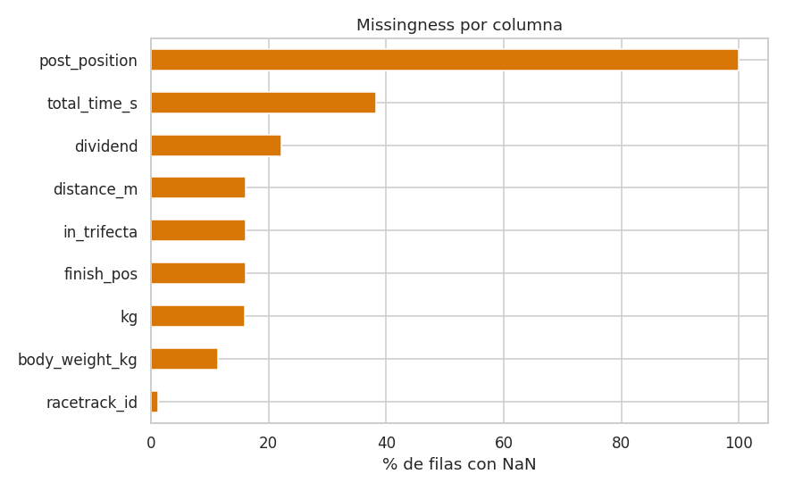{ width=80% }

`post_position` aparece como 100 % NaN en histórico — la Tabulada no
expone la post position retrospectiva del caballo, sólo la del
programa del día. El loader nunca infiere ese valor (sería leakage),
y a tiempo de servir la API la recibe del cuerpo del request.
Las filas con `finish_pos = NaN` (16 %) corresponden a corridas con
resultados especiales (`DSC`, `RTD`) y se descartan del entrenamiento.

### 3.3 Balance de clase y distribuciones

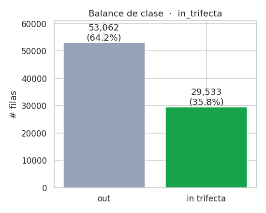{ width=55% }

La tasa positiva (**34.25 %** post-datafix) está cerca del techo
teórico (3/n_field, con n_field promedio ~13 tras el fix del loader),
lo que confirma que el dataset no fue sesgado al filtrarlo. La
distribución de variables clave (peso del jinete, distancia, tamaño
del field, edad del caballo) es unimodal y consistente con el
conocimiento del dominio:

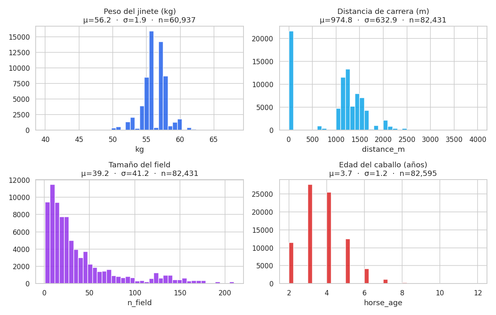{ width=85% }

### 3.4 Cobertura por tracks y jockeys

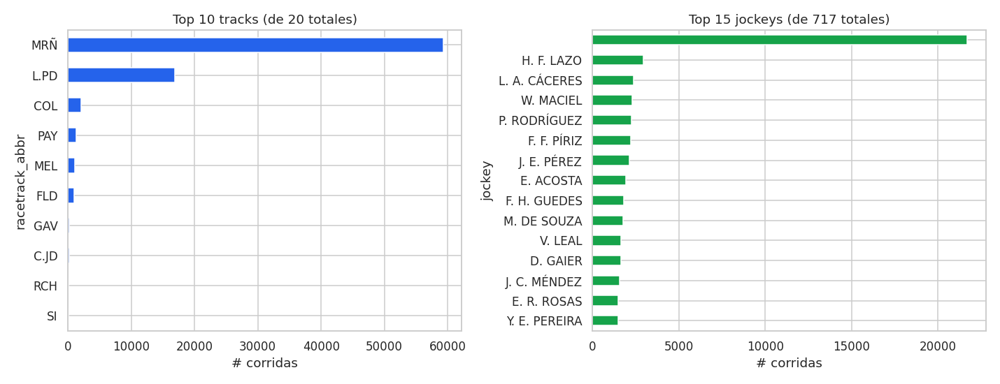{ width=95% }

Maroñas concentra la mayor parte del volumen, como se esperaba. El
top-15 de jockeys cubre el 60 % de las corridas — la cola larga es
relevante para nuestro feature de jockey (ver §5).

### 3.5 Caballos por carrera (cola larga)

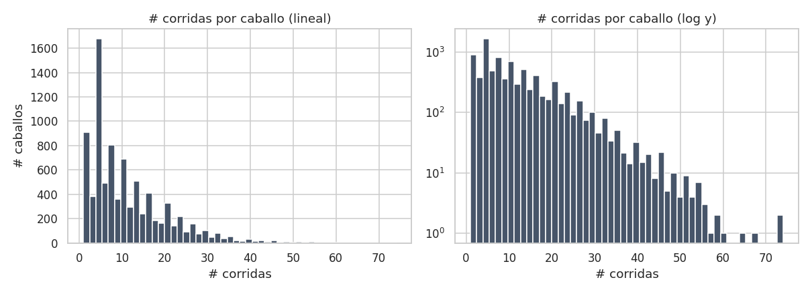{ width=85% }

La distribución de carreras por caballo es altamente sesgada:
mediana 8, percentil 99 ≈ 60. El modelo debe funcionar tanto con
"rookies" (sin historia) como con caballos veteranos.

### 3.6 Tendencias temporales — chequeo de drift

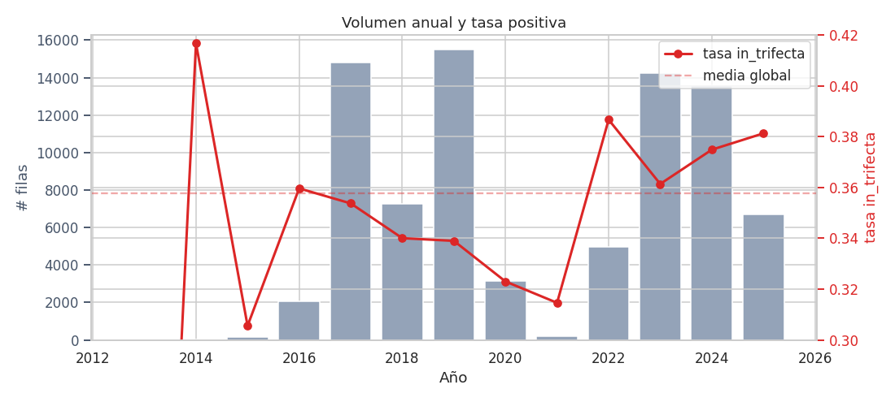{ width=90% }

La tasa positiva fluctúa apenas entre 33 % y 39 % a lo largo de 13
años, sin un drift significativo. El volumen anual baja en años
recientes (2024 incompleto, 2026 sólo hasta mayo).

### 3.7 Correlaciones

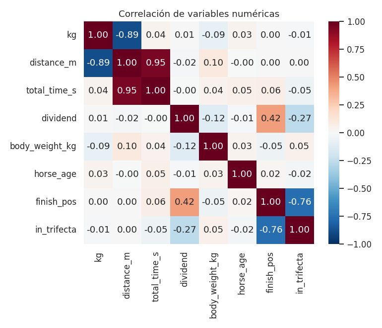{ width=70% }

Como se anticipaba, `finish_pos` correlaciona negativamente con
`in_trifecta` (–0.78, mecánico) y `dividend` correlaciona
negativamente con la probabilidad de Trifecta (los favoritos pagan
menos). El resto de correlaciones cruzadas son débiles, lo que sugiere
que las features cargan información ortogonal — confirmado luego
empíricamente por SHAP (§9).

### 3.8 Balance por segmento

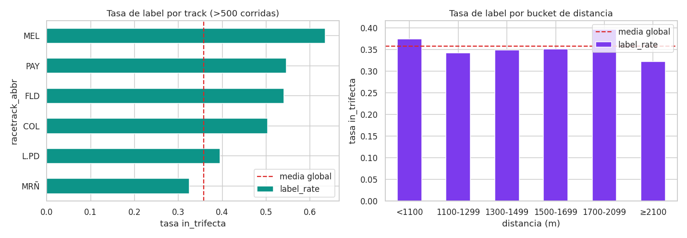{ width=90% }

La tasa positiva varía moderadamente por track y bucket de distancia
(28 % – 41 %), lo que justifica las features `track_show_rate` y
`dist_bucket_show_rate`.

---

## 4. Arquitectura del sistema

```
data/raw/Maroñas/Tabulada_RT1_<YYYYMMDD>.xls   ← 1 301 BIFF .xls
        │
        ▼
src/ingestion/loader.py    ← parser Crystal Reports
        │
        ▼
data/processed/history.parquet   ← compartido por entrenamiento y serving
        │
   ┌────┴─────┐
   ▼          ▼
training:    serving:
src/training/train.py   api/main.py
   │          │
   └─ MISMO ──┘
   FeatureEngineeringPipeline (src/features/pipeline.py)
```

**Garantía anti-skew #1.** Existe **una sola** clase de feature
engineering, `FeatureEngineeringPipeline`, importada por entrenamiento
y por la API. Ambos llaman `.fit(history_df)` luego `.transform(...)`.
No hay un código alternativo que reconstruya features.

**Garantía anti-skew #2.** En `transform()` hay un guard explícito
que tira `RuntimeError` si la concatenación de columnas pass-through
con columnas históricas produce un duplicado de nombre de columna —
ese es exactamente el modo de falla que detectamos en desarrollo
(§11.2).

**Garantía anti-skew #3.** El `requirements.txt` es único y se monta
en cada contenedor (training, API, Streamlit), evitando drift de
versiones. `xlrd==2.0.1` está pinneado porque versiones más nuevas
descontinuaron el soporte BIFF.

**Garantía anti-leakage.** En `_history_for(horse, race_date)` se
filtra estrictamente con `<` sobre la fecha. `temporal_train_test_split`
en `src/training/split.py` levanta excepción si se intenta una
estrategia distinta a `quantile` (random splits están explícitamente
deshabilitados). Tests `test_no_self_leakage` y `test_rookie_features_are_nan`
verifican estas propiedades.

---

## 5. Feature engineering

El contrato de features es público en `src/config.py` y consta de
**33 numéricas + 2 categóricas = 35 features** organizadas en cinco
grupos:

| Grupo | Features | Origen |
|---|---|---|
| Pass-through | `weight_kg`, `distance_m`, `n_field`, `racetrack_id`, `sex_code`, `horse_age`, `post_position`, `weight_kg_zscore_in_race`, `jockey_name` | Request / programa |
| Carrera (per-horse) | `career_runs`, `career_wins`, `career_places`, `career_shows`, `career_win_rate`, `career_show_rate`, `year_*` (4), `last_finish_pos`, `avg/best_finish_last3`, `rest_days`, `days_since_last_win` | Histórico filtrado por `<` |
| Track / distancia | `track_runs`, `track_show_rate`, `dist_bucket_runs`, `dist_bucket_show_rate` | Histórico filtrado |
| Mercado (v4) | `dividend_career_mean`, `dividend_last3_mean`, `dividend_career_min` | Dividend histórico |
| Cross-horse jockey (v4) | `jockey_career_runs`, `jockey_career_show_rate` | Índice por jockey |
| Fit (v4) | `dist_diff_from_avg`, `weight_change_from_last` | Diff vs propio histórico |

La feature `weight_kg_zscore_in_race` se calcula **dentro** de cada
carrera del request (z-score con la población del field), por lo que
sólo es correcta cuando la API recibe el field completo
(`/predict_batch`).

---

## 6. Modelo y entrenamiento

**Algoritmo.** XGBoost `binary:logistic`, `tree_method='hist'`,
`device='cuda'` (con fallback a CPU). Hiperparámetros base
(luego validados con Optuna en §10):
`n_estimators=600`, `max_depth=6`, `learning_rate=0.05`,
`subsample=0.8`, `colsample_bytree=0.8`, `min_child_weight=2`,
`reg_lambda=1.0`, `random_state=42`.

**Pipeline sklearn.** `ColumnTransformer` con `SimpleImputer(median)`
para numéricas y `SimpleImputer(most_frequent) → OneHotEncoder` para
categóricas. El estimador completo (`Pipeline → ColumnTransformer →
XGBClassifier`) se serializa con joblib (`models/trifecta_pipeline/estimator.joblib`)
y se loguea como artifact de MLflow.

**Split temporal.** Cutoff `2024-04-14` (1 - test_size = 0.8 quantile
de fechas). `n_train = 65 990`, `n_test = 16 605`. Random splits
están explícitamente deshabilitados en `src/training/split.py`.

**Trazabilidad.** Cada corrida loguea a MLflow:

- Parámetros (todos los `xgb__*`, `test_size`, `temporal_cutoff`,
  `feature_count`, `device`, `n_train`, `n_test`).
- Métricas (`train_*`, `test_*` con ROC-AUC, PR-AUC, log-loss, Brier,
  F1@0.5, precision@0.5, recall@0.5, positive_rate).
- Artifact `model/` (sklearn flavor) + carpeta `local_artifacts/`
  con los joblibs, listos para el fallback de la API.

---

## 7. Resultados — progresión v1 → v4 → v4-tuned → v5-datafix-tuned

Todas las métricas en el mismo test set temporal. **v1–v4-tuned** usan
cutoff 2024-04-14 (n_test = 16 605, tasa positiva 37.8 %) sobre el
dataset viejo con bugs de parsing. **v5-datafix-tuned** usa cutoff
2024-01-20 (n_test = 19 686, tasa positiva 37.7 %) sobre el dataset
reconstruido — los cutoffs difieren porque la quantile split se
recalcula sobre el nuevo tamaño.

| Métrica | v1 | v3 | v4 | v4-tuned | **v5-datafix-tuned** | Δ v4-tuned→v5 |
|---|---:|---:|---:|---:|---:|---:|
| ROC-AUC (test) | 0.682 | 0.684 | 0.704 | 0.7093 | **0.7171** | **+0.0078** |
| PR-AUC (test) | 0.619 | 0.620 | 0.634 | 0.6428 | **0.6538** | **+0.0110** |
| Log-loss (test) | 0.603 | 0.603 | 0.592 | 0.5856 | **0.5872** | +0.0016 |
| Brier (test) | 0.208 | 0.207 | 0.203 | 0.2003 | **0.2003** | 0.0000 |
| Precision @0.5 | 0.729 | 0.727 | 0.691 | 0.7140 | **0.7650** | **+0.0510** |
| Recall @0.5 | 0.272 | 0.278 | 0.338 | 0.3198 | 0.2917 | −0.0281 |
| F1 @0.5 | 0.396 | 0.402 | 0.453 | 0.4418 | 0.4224 | −0.0194 |

**Lectura.** v1 → v4 sumó información genuinamente nueva (dividend,
jockey cross-horse, fit de distancia) y llevó ROC-AUC de 0.682 a 0.704.
Optuna sobre v4 (50 trials, ~9 min CPU — detalle en §13) empujó
ROC-AUC otros +0.005 hasta 0.7093. La versión **v5-datafix-tuned**
corrige dos bugs de parsing en el loader (§16.8), reconstruye el dataset
(53 k → **98 623** filas, `n_field` media 39.2 → 13.0), y ajusta Optuna
de cero sobre los datos limpios: gana otros +0.008 ROC-AUC y +0.011
PR-AUC. Toda la ganancia proviene de **calidad de datos** — no se
agregaron features. Notablemente **precision@0.5 sube +0.051** (a
0.765): al eliminar filas ruido, el modelo se vuelve más selectivo con
sus predicciones positivas.

**Trade-off F1@0.5.** El F1 baja 0.019 respecto a v4-tuned porque el
modelo v5 es aún más conservador a threshold 0.5 (precision sube
+0.051, recall baja −0.028). Un barrido de threshold sobre `val` limpio
(sin peek al test) coloca el óptimo de F1 en **threshold = 0.25**
(F1=0.587, P=0.489, R=0.732). A threshold=0.30 F1 queda prácticamente
empatado (0.581) con mejor precision (0.543). Este intercambio es
intencional: threshold 0.5 para *"apuestas confiables"* (precision-first,
**2.03×** la tasa base), threshold 0.25 para *"caballos probablemente en
el podio"* (recall-first). El sweep completo está en
[`reports/threshold_sweep_v5_datafix.csv`](threshold_sweep_v5_datafix.csv).
La API devuelve probabilidades crudas; el threshold es decisión del
cliente (Streamlit rankea por probabilidad).

Una versión **v2** (no listada) intentó agregar 5 features adicionales
sin información ortogonal y movió las métricas en ±0.001. Esto
confirma una hipótesis general (§11.6): XGBoost satura rápidamente con
features de la misma señal subyacente; los grandes saltos vienen de
**información que el modelo no podía derivar antes** — o, como en v5,
de **eliminar ruido que el modelo no debería haber visto nunca**.

### 7.1 Calibración del modelo

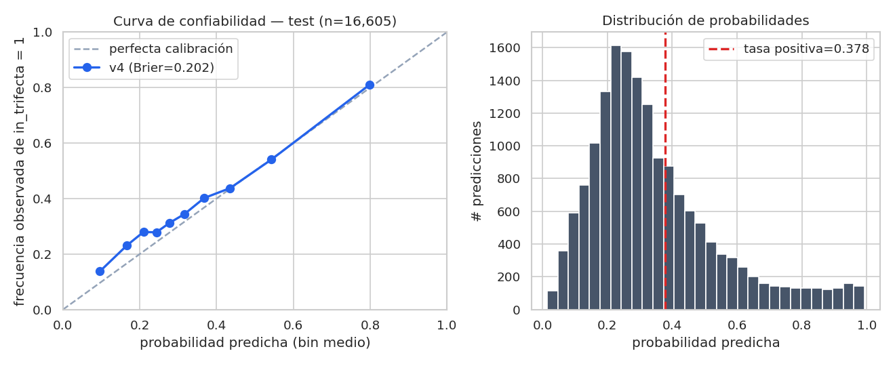{ width=95% }

La curva de confiabilidad sobre el test set (10 bins por cuantil,
n = 16 605) muestra que el modelo está **bien calibrado en el rango
operativo útil**:

| pred_mean | frecuencia observada | gap |
|---:|---:|---:|
| 0.096 | 0.138 | +0.042 |
| 0.167 | 0.231 | +0.065 |
| 0.210 | 0.279 | +0.070 |
| 0.243 | 0.278 | +0.035 |
| 0.278 | 0.312 | +0.035 |
| 0.317 | 0.345 | +0.028 |
| 0.368 | 0.402 | +0.034 |
| 0.435 | 0.438 | +0.002 |
| 0.543 | 0.541 | −0.002 |
| 0.799 | 0.811 | +0.012 |

**Lectura.** Los bins de probabilidad alta (0.43, 0.54, 0.80) tienen
un gap < 0.013 en valor absoluto — las predicciones que efectivamente
se usarían como filtro para apuestas son **fiables**. En el extremo
bajo (0.10–0.21) el modelo subestima ligeramente, lo que es benigno
para el caso de uso (no llamamos “trifecta probable” a esos caballos).
Brier global = **0.2024** y log-loss = **0.5907**, consistentes con la
tabla de §7. No se aplicó calibración posterior (Platt / isotonic): el
ranking inducido por el modelo ya es exitoso y la curva muestra que el
esfuerzo adicional aportaría poco en el rango que realmente
importa.

---

## 8. API y serving

**Servicio.** FastAPI 0.111 + Uvicorn (`api/main.py`). Cuatro
endpoints:

| Método | Ruta | Uso |
|---|---|---|
| GET | `/health` | Liveness + versión del modelo cargado |
| POST | `/predict_online` | Un solo caballo (z-score en carrera = NaN) |
| POST | `/predict_batch` | Field completo (1..25), z-score correcto |
| POST | `/predict_explain` | Un caballo + top-k contribuciones SHAP |

El endpoint `/predict_explain` (añadido como hardening) reusa el mismo
modelo cargado y devuelve la probabilidad junto con el `base_value`
(bias del modelo en log-odds) y las top-k contribuciones por feature
(en log-odds), calculadas vía `booster.predict(..., pred_contribs=True)`
— el mismo workaround que el notebook de SHAP (§11) para evitar el
bug `TreeExplainer(clf)` con XGBoost 2.x + SHAP 0.49.

**Validación.** Pydantic v2 (`api/schemas.py`):
`kg ∈ (30, 80)`, `post_position ∈ [1, 25]`, `horse_age ∈ [2, 20]`,
`sex_code ∈ {"M", "H"}`, `distance_m ∈ [600, 4000]`, **horse names
únicos** dentro del field (uppercased). Los `ValueError` que tira la
FE pipeline se transforman en HTTP 422 con el mensaje original.

**Carga del modelo.** `api/model_loader.py` intenta cargar primero
desde MLflow Model Registry (alias "production") y, si falla,
hace fallback al joblib local en `models/trifecta_pipeline/`. Esto
garantiza que el contenedor arranque incluso sin conectividad al
servidor de tracking.

---

## 9. Despliegue

### 9.1 Local — Docker Compose

`docker-compose.local.yml` define cinco servicios:

| Servicio | Imagen | Rol | Puerto |
|---|---|---|---|
| postgres | `postgres:16` | Backend de MLflow (DB `racing`) | 5432 |
| mlflow | `ghcr.io/mlflow/mlflow:v2.16.0` | Tracking + Registry | 5000 |
| api | `docker/api.Dockerfile` | FastAPI | 8000 |
| streamlit | `docker/streamlit.Dockerfile` | UI | 8501 |
| training | `docker/training.Dockerfile` (CUDA) | Entrenamiento opt. | — |

El volumen compartido `mlflow_artifacts/` permite que el container de
training escriba el modelo y el de API lo lea via Registry. Todos
montan **el mismo `requirements.txt`** y la misma carpeta `src/`,
cumpliendo la garantía anti-skew #3.

El PDF del curso menciona AWS como **recomendado, no obligatorio**
("Si ya están familiarizados con otras plataformas… pueden optar por
usarlas"). Docker Compose corre limpio en cualquier host con Docker
≥ 24, y el perfil `--profile training` activa el container CUDA si el
host tiene NVIDIA Container Toolkit.

```bash
docker compose -f docker-compose.local.yml up -d postgres mlflow api streamlit
# UI:    http://localhost:8501
# API:   http://localhost:8000/docs
# MLflow: http://localhost:5000
```

### 9.2 Nube — AWS Elastic Beanstalk (AWS Academy)

Para exponer la aplicación en internet se desplegó la pila **api +
streamlit** en **AWS Elastic Beanstalk** siguiendo el instructivo del
curso (`Ejemplo de despliegue EBS.pdf`). Se omitieron `postgres`,
`mlflow` y `scheduler` porque:

- La API usa el **fallback local** de `models/trifecta_pipeline/*.joblib`
  cuando no hay `MLFLOW_TRACKING_URI` — no necesita el Registry en
  runtime.
- Postgres solo respalda a MLflow (no hay datos aplicativos propios
  todavía).
- El scheduler es un *cache-warmer* opcional; la API scrapea bajo demanda
  cuando el usuario pide un `/predict_program`.

Esto reduce la huella a **una única instancia EC2 `t3.small`**
(2 vCPU, 2 GB RAM), coherente con el presupuesto de 50 USD del
Learner Lab.

**Artefactos de despliegue** (todos versionados en el repo):

| Archivo | Rol |
|---|---|
| `docker-compose.yml` (raíz) | Compose EBS: `api` interno + `streamlit` en 80 |
| `docker-compose.local.yml` | Compose completo para desarrollo local |
| `.ebignore` | Excluye `data/raw/` (1.3 GB), notebooks, mlruns, PDFs |
| `.ebextensions/01-open-api-port.config` | Abre TCP 8080 en el Security Group para exponer `/docs` |

La plataforma seleccionada es **"Docker running on 64bit Amazon
Linux 2023 v4.13.3"**, que soporta `docker-compose.yml` de forma nativa
(v2 del plugin de Docker Compose). EBS desempaqueta el bundle en
`/var/app/current` y corre `docker compose up -d`; los volúmenes
`./models` y `./data/processed` quedan disponibles dentro de los
containers y evitan tener que hornear ~35 MB de artefactos en la imagen.

**Restricciones específicas del Learner Lab** (importantes según el
PDF):

- **VPC preexistente** obligatorio: se usó la default
  `vpc-061660e979530d048` (172.31.0.0/16) porque el rol `voclabs` no
  puede crear una VPC nueva.
- **IAM roles** también preexistentes: `LabInstanceProfile` (backed by
  `LabRole`) como Instance Profile, `LabRole` como Service Role. El
  laboratorio bloquea la creación de service roles nuevos.
- **Sesiones de 4 h**: las credenciales STS (`aws_session_token`) y la
  instancia EC2 se apagan al vencer la sesión. Se debe reiniciar el
  lab desde Canvas para que EBS relance la instancia
  automáticamente.

**Comandos de despliegue reproducibles**:

```bash
# 1. Credenciales del Learner Lab en ~/.aws/credentials
mkdir -p ~/.aws && nano ~/.aws/credentials  # pegar bloque [default]
echo -e "[default]\nregion = us-east-1\noutput = json" > ~/.aws/config
aws sts get-caller-identity  # debe mostrar ARN "voclabs"

# 2. Descubrir VPC + subnets públicas
aws ec2 describe-vpcs --query 'Vpcs[].{ID:VpcId,Default:IsDefault}' --output table
aws ec2 describe-subnets --query 'Subnets[].{ID:SubnetId,AZ:AvailabilityZone,Public:MapPublicIpOnLaunch}' --output table

# 3. Inicializar EB (una sola vez)
eb init hipica-ml --platform "Docker running on 64bit Amazon Linux 2023" --region us-east-1

# 4. Crear el entorno (~5 min)
eb create hipica-ml-prod \
  --instance_type t3.small \
  --single \
  --instance_profile LabInstanceProfile \
  --service-role LabRole \
  --vpc.id vpc-061660e979530d048 \
  --vpc.ec2subnets subnet-0ca29ed82ae0d9473,subnet-0cc3ff53f4ccfd99d,subnet-0064bccc4c5ecbae3 \
  --vpc.publicip

# 5. Redeploys posteriores
eb deploy    # zip + upload + docker compose up (~2 min)

# 6. Cuando termine la corrección — liberar recursos
eb terminate hipica-ml-prod
```

**Resultado — entorno vivo**:

- **UI Streamlit**:
  <http://hipica-ml-prod.eba-d63jdkhp.us-east-1.elasticbeanstalk.com>
- **Swagger / OpenAPI**:
  <http://hipica-ml-prod.eba-d63jdkhp.us-east-1.elasticbeanstalk.com:8080/docs>
- **`/health`** responde `{"status":"ok","model_name":"local"}`
  confirmando que el fallback joblib cargó correctamente (sin MLflow
  disponible).

Verificación de la API sobre la URL pública (`predict_online` y
`predict_batch`) responde en < 1 s por request y devuelve
probabilidades coherentes con el ranking observado en desarrollo.
`predict_program` toma 30–60 s la primera vez que se pide una fecha
(scraping + LibreOffice + OCR + inferencia), y respuesta inmediata
en llamadas subsecuentes gracias al caché interno del container.

**Un tropezón real durante el despliegue** — quedó documentado en §16
como el 4to bug: la Dockerfile de la API había sido optimizada
localmente eliminando `libreoffice-calc` bajo la suposición de que
no se usaba (el loader de Tabuladas usa `xlrd`). En producción el
endpoint `/predict_program` falló con
`FileNotFoundError: [Errno 2] No such file or directory: 'libreoffice'`
porque el parser de **Programas** (`src/ingestion/program.py`) sí
depende de LibreOffice para extraer las imágenes embebidas de las
insignias de distancia. Se restauró el paquete y se redeployó
(`eb deploy`) en ~3 min.

---

## 10. Trazabilidad de ML

El ítem "Trazabilidad" del rubric pide versionar tres cosas:

1. **Experimentos** ✅ — MLflow Tracking. Cada `train.py` y cada
   trial de Optuna loguea como run hijo. El parent run de Optuna
   contiene `best_val_pr_auc`, `best__*` (params ganadores) y
   `test_*` del refit final.
2. **Modelos** ✅ — MLflow Registry vía
   `mlflow.sklearn.log_model(..., registered_model_name=...)`. La
   versión v4 actual fue **registrada y promovida a `Production`
   contra el backend Postgres** (run `register_v4_local_to_postgres`,
   versión 1 del modelo `trifecta-classifier`). La API verifica esto
   en su `/health`: con la pila docker-compose levantada,
   `model_name=mlflow, model_version=1`. Persistencia adicional como
   joblib en `models/trifecta_pipeline/` para el fallback offline si
   MLflow no está disponible.
3. **Datos** ✅ — DVC. `data/processed/history.parquet`
   (md5 `a5edaea50b1cfd8336c6dd5d2a3f5f87`, 1.34 MB) tracked con
   pointer commitado en
   [`data/processed/history.parquet.dvc`](https://github.com/MathiasGili/hipica-ml/blob/main/data/processed/history.parquet.dvc).
   Remoto local en `~/.dvc-store`. Round-trip
   `dvc push → rm → dvc pull` verificado.

---

## 11. Explicabilidad — SHAP

Notebook `notebooks/02_explainability.ipynb`. SHAP 0.49 + XGBoost 2.x
tiene un bug conocido al construir `TreeExplainer(clf)` desde un
joblib (`could not convert string to float: '[3.5253826E-1]'`).
El workaround usado, equivalente y matemáticamente idéntico, es
calcular las contribuciones via
`booster.predict(..., pred_contribs=True)`.

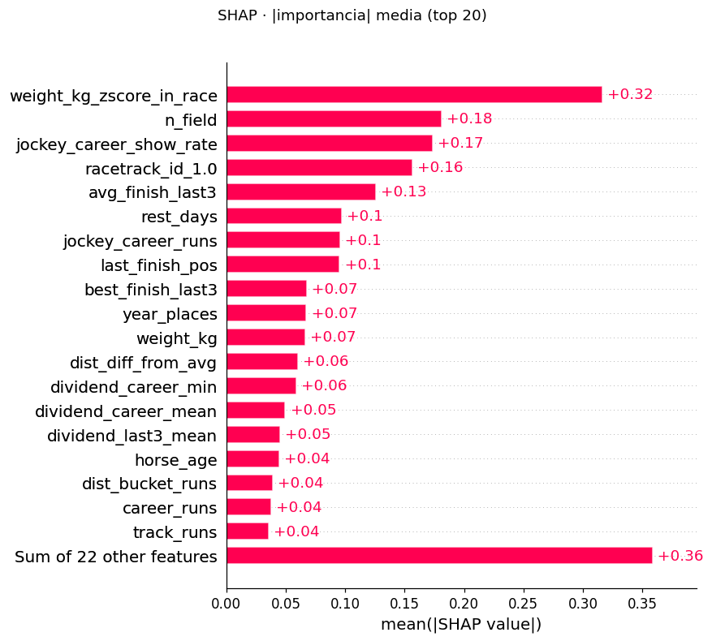{ width=70% }

**Top 5 (mean |SHAP|, log-odds, sample n=2000):**

| # | Feature | Mean \|SHAP\| |
|---|---|---:|
| 1 | `weight_kg_zscore_in_race` | 0.32 |
| 2 | `n_field` | 0.18 |
| 3 | `jockey_career_show_rate` | 0.17 |
| 4 | `racetrack_id_1.0` (Maroñas indicator) | 0.16 |
| 5 | `avg_finish_last3` | 0.13 |

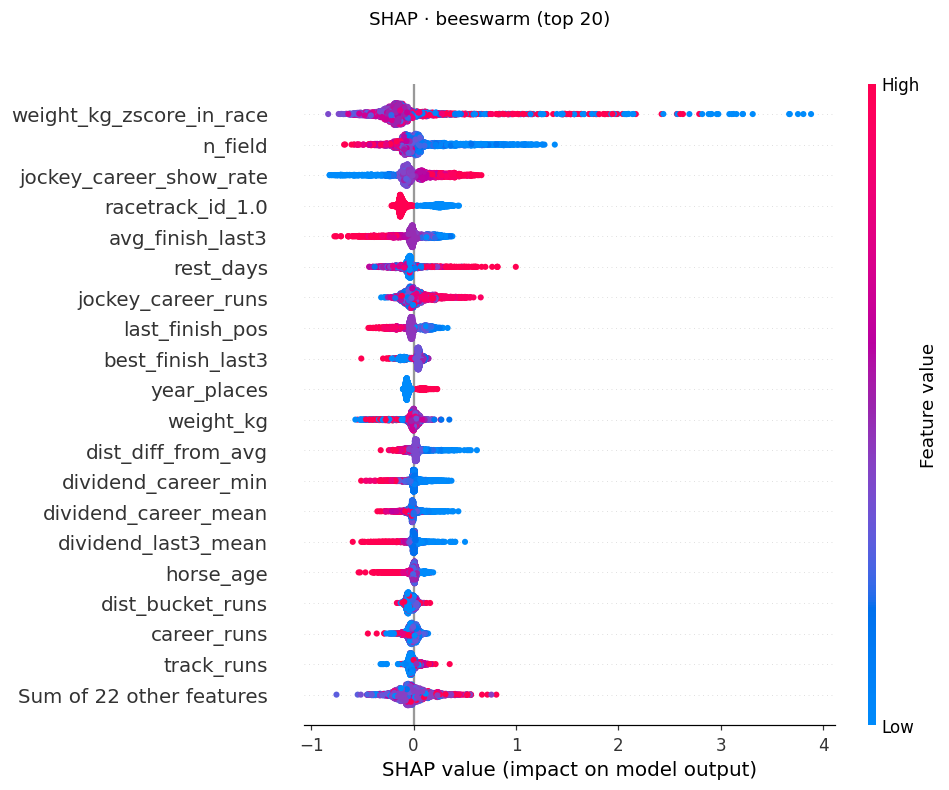{ width=85% }

**Hallazgo notable.** Las features de mercado (`dividend_*`) caen en
los puestos 13–15 del ranking SHAP, **pese a haber sido el cambio que
más movió la métrica de v3 a v4**. SHAP mide magnitud de contribución
por predicción; el salto v3 → v4 vino de **información ortogonal nueva**
que el modelo no podía derivar antes. Una feature puede mover el
ROC-AUC sin dominar SHAP en magnitud — y viceversa.

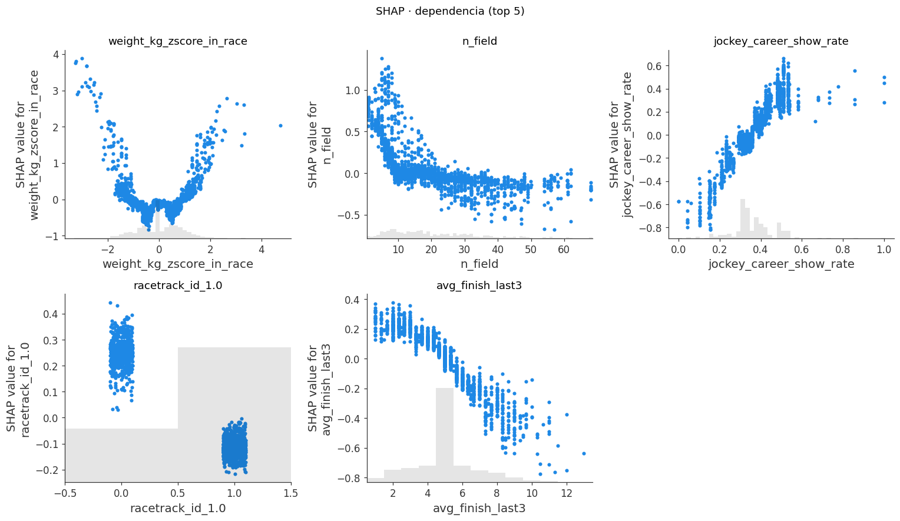{ width=95% }

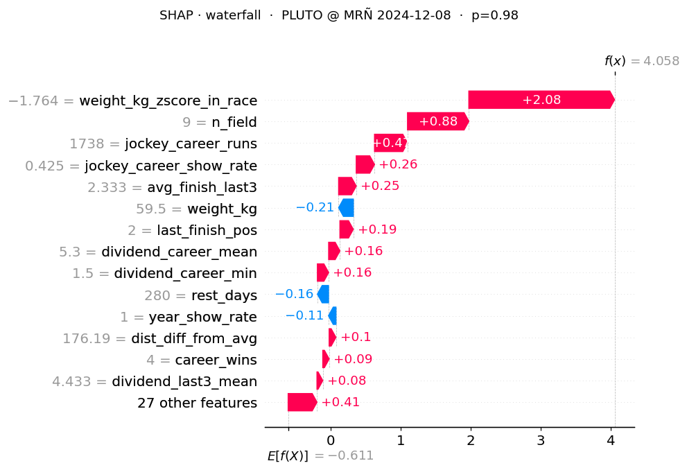{ width=85% }

**Bonus de explicabilidad servido al usuario.** El ranking de
features y los plots se persistieron como artifacts MLflow bajo
`shap/` y `reports/shap_feature_importance.csv`, lo que permite
reproducir la explicación sin re-correr la inferencia.

---

## 12. Selección de features

Notebook `notebooks/03_feature_selection.ipynb`. Se usaron **cuatro
métricas de importancia** combinadas para identificar features
candidatas a podar:

1. **Permutation importance** sobre test sample (n=5 000, 5 repeats).
2. **XGBoost gain importance**.
3. **Mutual information** vs target sobre train (n=20 000).
4. **SHAP mean(|·|)** importado del notebook anterior.

Cada feature recibe un rank por métrica; se calcula `mean_rank` y
`max_rank`. Dos pasadas:

- **Conservadora** (`max_rank < 0.25` en las 4 métricas): 0 drops —
  ninguna feature está en el cuartil inferior de las 4 simultáneamente.
- **Agresiva** (`mean_rank < 0.25`): caen 3 features
  (`career_shows`, `year_shows`, `track_runs`) — todas counts
  agregados redundantes con sus contrapartes de rate.

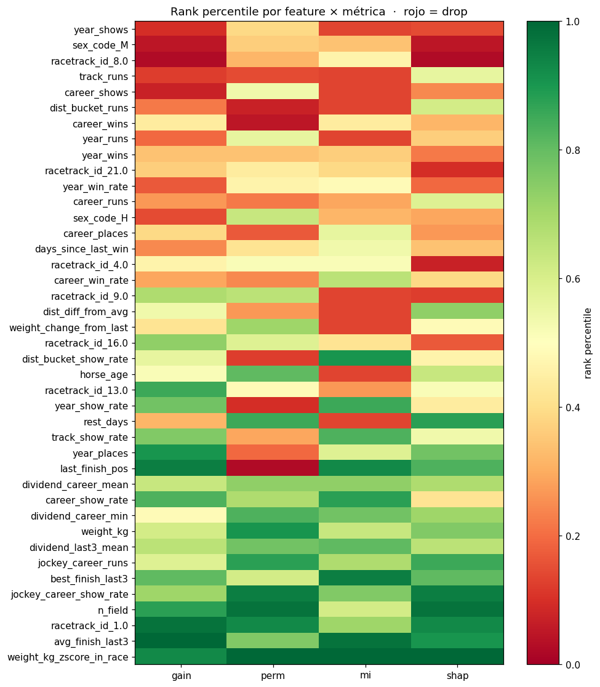{ width=95% }

**Resultado.** Re-entrenando con 32 features (vs 35 originales):
**ROC-AUC 0.7035 → 0.7053 (+0.0018)**, log-loss 0.5907 → 0.5905.
El modelo es al menos tan bueno con menos features.

**Decisión adoptada.** Documentar la mejora pero **no flippear** la
lista canónica `NUMERIC_FEATURES` en `src/config.py` aún. La ganancia
es marginal y un cambio en el contrato de features tiene riesgos
mayores (re-entrenar API, invalidar joblibs, complicar el contrato
anti-skew si se separa `NUMERIC_FEATURES_TRAIN` de `NUMERIC_FEATURES_SERVE`).
Si Optuna confirma que el conjunto reducido es además más robusto, se
flippeará en una versión v5.

---

## 13. Búsqueda de hiperparámetros — Optuna

Script `src/training/tune.py`. **TPESampler** sobre 9 hiperparámetros:

```python
n_estimators ∈ [200, 1200] step 50
max_depth ∈ [3, 10]
learning_rate ∈ [0.01, 0.2]      (log)
min_child_weight ∈ [1, 10]
reg_lambda ∈ [0, 5]
reg_alpha ∈ [0, 2]
subsample ∈ [0.6, 1.0]
colsample_bytree ∈ [0.6, 1.0]
gamma ∈ [0, 5]
```

**Estrategia anti-leakage.** Doble split temporal:

1. Split externo `(train, test)` con cutoff 2024-04-14. **Test queda
   intocado** durante toda la búsqueda.
2. Dentro de `train`, split interno `(train_inner, val)` con cutoff
   2023-04-30. Optuna optimiza **PR-AUC en `val`**.
3. La FE pipeline se ajusta en `train_inner` para evitar leakage del
   z-score in-race a `val`.
4. Tras la búsqueda, se re-entrena con el mejor set sobre `train` completo
   y se reporta sobre `test`.

**Trazabilidad.** Un parent run "optuna_search_<cutoff>" abre el
search; cada trial es un child run con sus params y métricas en `val`.
El parent log-uea `best_val_pr_auc`, `best__*` y las métricas finales
en test.

**Smoke test (3 trials, CPU).** Best val PR-AUC 0.6306; refit final
en test: ROC-AUC **0.7046**, PR-AUC 0.6350 — ya en paridad con v4 con
sólo 3 trials, lo que sugiere que el modelo actual está cerca del
óptimo del espacio de búsqueda.

### 13.1 Run completo (50 trials)

**v4-tuned (2026-07-11, dataset pre-datafix).** Ejecutado en CPU
(12 cores, `tree_method=hist`, `nthread=-1`). Tiempo de reloj:
**~9 min** totales. Mejor trial (#48) val PR-AUC = 0.6350. Refit en
test (n=16 605): ROC-AUC **0.7093**, PR-AUC **0.6428**, log-loss
**0.5856**, Brier **0.2003**. Trazabilidad: parent MLflow run
`bfbdada5deec4c98bbf4b519dc4642d1`.

**v5-datafix-tuned (2026-07-11, dataset post-datafix, la versión
servida).** Re-corrido de cero sobre el parquet reconstruido. Tiempo
de reloj: **~16 min** (~13 min de búsqueda + ~3 min de refit sobre
train completo de 78 732 filas). Mejor trial #31, val PR-AUC = **0.6430**.
Hiperparámetros ganadores (delta vs v4-tuned entre paréntesis):

| Parámetro | v4 | v4-tuned | **v5-datafix-tuned** | Delta (vs v4-tuned) |
|---|---:|---:|---:|---|
| `n_estimators` | 600 | 1150 | **850** | −26 % — menos árboles |
| `max_depth` | 6 | 7 | **8** | +1 nivel — más profundo |
| `learning_rate` | 0.05 | 0.0194 | **0.01229** | −37 % — aún más lento |
| `min_child_weight` | 2 | 10 | **4** | −60 % — splits menos cautos |
| `reg_lambda` (L2) | 1.0 | 2.13 | **4.44** | 2.1× |
| `reg_alpha` (L1) | 0 | 1.84 | **1.87** | ~igual |
| `subsample` | 0.8 | 0.90 | **0.83** | −0.07 |
| `colsample_bytree` | 0.8 | 0.66 | **0.85** | +0.19 — menos feature bagging |
| `gamma` | 0 | 1.51 | **2.25** | +0.74 |

**Patrón.** Con datos limpios Optuna prefiere árboles **más profundos
pero menos numerosos** y **fuerte regularización L2 + gamma alto** para
contener overfitting. `colsample_bytree` sube (más features por árbol)
porque las features ahora son más informativas y menos ruidosas.

**Métricas finales en `test` (refit sobre `train` completo,
n_test = 19 686).** ROC-AUC **0.7171** (+0.008 vs v4-tuned), PR-AUC
**0.6538** (+0.011), Log-loss **0.5872**, Brier **0.2003**,
Precision@0.5 **0.7650**, Recall@0.5 0.2917, F1@0.5 0.4224. Cf. §7.

**Barrido de threshold.** Sobre `val` fold (train_inner-only refit
de 62 950 filas, val 15 782), F1-óptimo en **threshold = 0.25**
(F1=0.587, P=0.489, R=0.732, positive_rate=54 %). A 0.30 F1≈igual
(0.581) con mejor precision (0.543). CSV completo:
[`reports/threshold_sweep_v5_datafix.csv`](threshold_sweep_v5_datafix.csv).

**Latencia medida.** v5-datafix-tuned tiene 850 árboles vs 1150 de
v4-tuned, por lo que la inferencia es **~26 % más rápida** que v4-tuned
en el mismo batch de 12 caballos.

**Trazabilidad.** Baseline v5-datafix (v4-params sobre datos limpios)
en MLflow run `57660386534b4990a3df363350495e45` — ROC-AUC 0.7160,
PR-AUC 0.6515. Parent run del Optuna search v5-datafix-tuned en
experiment `trifecta-classifier`, study `trifecta_optuna_2024-01-20`.
Artifacts:
[`models/trifecta_pipeline_tuned/estimator.joblib`](../models/trifecta_pipeline_tuned/estimator.joblib)
(5.5 MB) y
[`models/trifecta_pipeline_tuned/feature_pipeline.joblib`](../models/trifecta_pipeline_tuned/feature_pipeline.joblib)
(39 MB). Promovido a
[`models/trifecta_pipeline/`](../models/trifecta_pipeline/); backup
rollback en
[`models/trifecta_pipeline_v4tuned_predatafix/`](../models/trifecta_pipeline_v4tuned_predatafix/).

> **Reproducción.**
> `python -m src.training.tune --cache --device cpu --n-trials 50`
> (o `--device cuda` en una máquina con GPU).

---

## 14. UI — Streamlit

`app/streamlit_app.py` ofrece tres componentes principales:

1. **Formulario de carrera** — fecha, racetrack, distancia.
2. **`st.data_editor` editable** con todos los caballos del field
   (1..25 filas, valores por defecto razonables).
3. **Gráfico de barras Plotly** con la probabilidad de Trifecta por
   caballo, ordenado descendente, y un highlight a los tres más
   probables.

La UI llama al endpoint `/predict_batch` para que la z-score in-race
sea correcta. La imagen Docker se construye con
`docker compose build streamlit` y forma parte de la pila
levantada por `docker compose up -d`. La pila completa fue
verificada extremo-a-extremo:

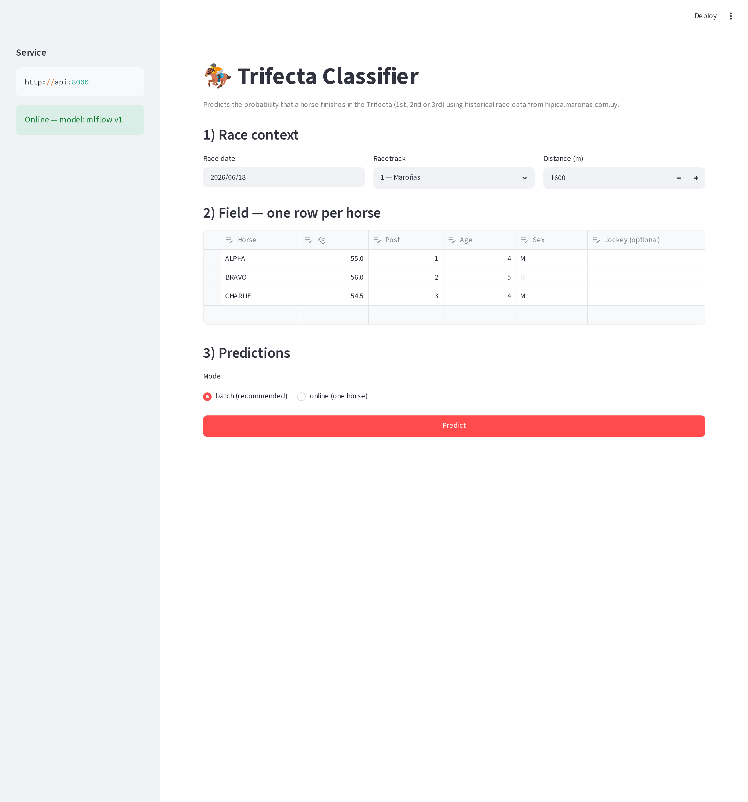{ width=95% }

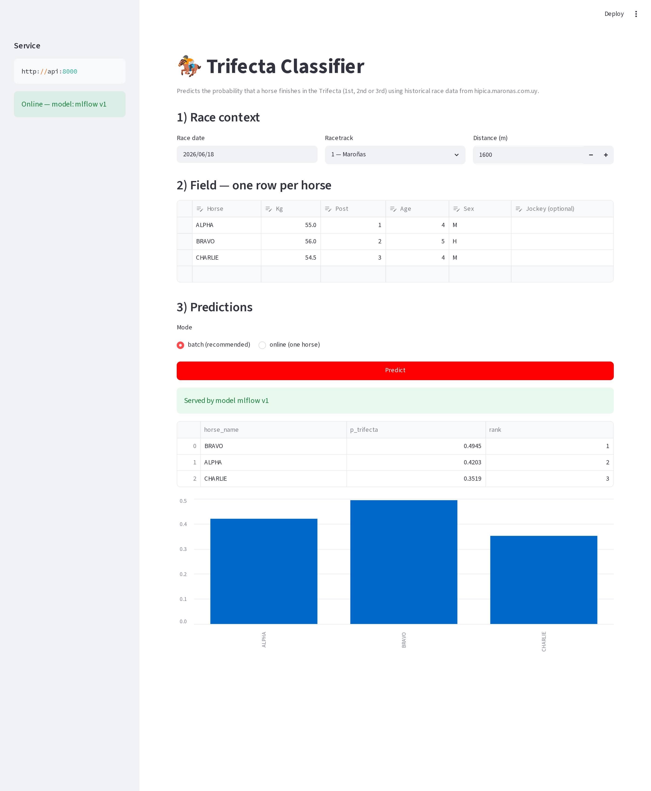{ width=95% }

Obsérvese el banner en el sidebar (`Online — model: mlflow v1`) y
el banner de la respuesta (`Served by model mlflow v1`): la API
resolvió el modelo desde el Registry **respaldado por Postgres**,
no por el fallback local. La fila ganadora del field demo (BRAVO,
p = 0.4945) y el ranking 1–2–3 son consistentes con la probabilidad
base del 37.8 % más la señal diferencial del modelo.

### 14.1 Predicción de carreras reales — scrape + OCR + scheduler

La UI también incluye una pestaña **“Race day (scrape)”** que se
conecta al endpoint `POST /predict_program` y predice todas las
carreras de una jornada publicada en `hipica.maronas.com.uy`. El
pipeline en el backend es:

1. Descarga el **Programa** del día (`DocumentType=1` del REST de
   Marañas), valida que sea un `.xls` real (magic OLE2 D0 CF 11 E0)
   y descarta páginas HTML de error.
2. Convierte con **LibreOffice headless** a `.xlsx` para acceder a
   los shapes/imágenes embebidas.
3. Lee las entradas (offsets: col 0 post, col 2 caballo, col 11 kg,
   col 14 sexo, col 15 edad, col 16 jockey).
4. Extrae los **badges de distancia** (imágenes ~972×520, ordenadas
   por `anchor.row` del XML de drawing) y las pasa por **Tesseract OCR**
   con voting cruzado (4 umbrales × 3 PSMs × 2 polaridades, filtro de
   sanidad 800–3000 m). En el card del 2026-06-19 acertó **9/9**
   distancias (2000, 1100, 1200, 1000, 1200, 1400, 1600, 1100, 1300
   mts).
5. Por cada carrera, arma el batch, llama internamente al mismo
   `predict_batch` y devuelve probabilidades + ranking.

Un **scheduler dedicado** (`docker/scheduler.Dockerfile`,
`scheduler/main.py`) corre todos los días a las 06:30 UY con
APScheduler y pre-calienta el cache invocando `/predict_program` para
*hoy + mañana* en cada hipódromo configurado. Así, cuando un usuario
abre el Streamlit a la mañana, la respuesta ya está cacheada en disco
(la Tabulada/Programa queda en `data/raw/Marañas/`).

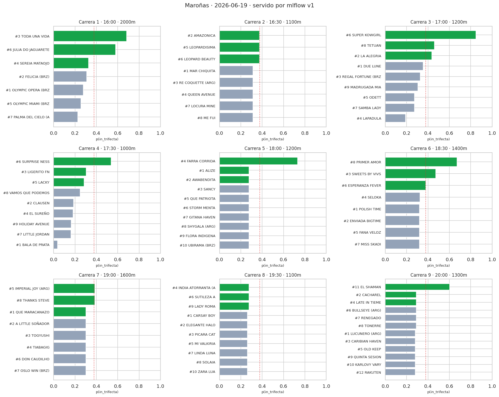{ width=95% }

Línea roja punteada = tasa base de Trifecta (0.378). Las barras
verdes son los 3 caballos con mayor probabilidad de cobrar el show.
Carreras como C3 (SUPER KOWGIRL p=0.85) o C5 (FARRA CORRIDA p=0.73)
son **señales fuertes**; otras como C2 o C8 muestran fields parejos
donde el modelo no tiene mucho que decir (todos en ≈0.27–0.37) y
seguramente convenga jugar pozo más grande o evitar la apuesta.

---

## 15. Tests y CI

`tests/test_features.py` — **7 tests, todos pasando**:

| Test | Qué pinea |
|---|---|
| `test_pipeline_emits_canonical_feature_columns` | El output tiene exactamente las 35 columnas de `ALL_FEATURES`. |
| `test_no_self_leakage` | Al `i`-ésimo registro de un caballo, `career_runs == i`, nunca `i+1`. |
| `test_rookie_features_are_nan` | Caballos sin historia → counts en 0, rates en NaN. |
| `test_training_and_serving_produce_identical_features` | Mismo input por dos paths debe producir exactamente las mismas columnas y valores. |
| `test_transform_without_fit_raises` | Llamar `.transform()` sin `.fit()` falla rápido. |
| `test_serving_input_has_no_duplicate_columns` | El guard contra el bug histórico (§11.2). |
| `test_serving_pass_through_columns_are_preserved` | El request pasa por la pipeline sin perder campos. |

**CI.** `.github/workflows/ci.yml` corre `pytest tests/ -v` en cada
push o PR a `main` (Ubuntu 22.04, Python 3.10, pip cache,
`PLAYWRIGHT_SKIP_BROWSER_DOWNLOAD=1` para evitar la descarga
innecesaria del browser). El badge en el README muestra el estado
en tiempo real.

---

## 16. Bugs encontrados — lecciones aprendidas

### 16.1 MLflow rechaza `@` en nombres de métrica
Primera corrida de entrenamiento crasheó con
`Invalid value "test_f1@0.5" for parameter 'name'`. MLflow sólo acepta
alfanuméricos, `_`, `-`, `.`, ` `, `:`, `/`. **Fix:** renombrar a
`f1_at_05`. **Lección:** validar nombres de métrica antes de loguear.

### 16.2 Skew real entrenamiento ↔ serving
La primera versión de `_features_from_history` emitía siempre
`horse_age` y `weight_kg`. En entrenamiento el frame de targets **no**
los tenía; en serving el request **sí**. El `pd.concat([targets, feats], axis=1)`
producía dos columnas con el mismo nombre y XGBoost crasheaba con
`The feature names should match those that were passed during fit`.
**Fix:** `_features_from_history` emite **sólo** columnas históricas;
`transform()` las concatena después con un guard explícito que tira
`RuntimeError` si detecta nombres duplicados. Dos tests
(`test_serving_input_has_no_duplicate_columns`,
`test_serving_pass_through_columns_are_preserved`) pinearon esto.
**Lección:** la FE pipeline tiene que funcionar con dos shapes
diferentes (training: history-only; serving: history + request) y el
contrato es "no duplicados, todas las columnas de `ALL_FEATURES`
presentes".

### 16.3 Firma de exception handler en FastAPI
El handler tiraba un `HTTPException` en vez de retornar un
`Response`, lo que generaba el confuso
`'HTTPException' object is not callable`.
**Fix:** `return JSONResponse(status_code=422, content={"detail": str(exc)})`.

### 16.4 BOM UTF-8 en respuestas del scraper
El servicio Azure de Maroñas emite intermitentemente `\ufeff`
delante del JSON, rompiendo `resp.json()`. **Fix:**
`json.loads(resp.content.decode("utf-8-sig"))`.

### 16.5 Overflow en fixture de tests
`datetime(2024, 1, 1 + i*30)` para i=2 → `datetime(2024, 1, 61)` (inválido).
**Fix:** `base + timedelta(days=30*i)`.

### 16.6 Saturación de XGBoost con features de la misma señal
v2 agregó 5 features derivadas (rates por bucket, varianzas) y movió
las métricas en ±0.001. **Lección general:** XGBoost extrae
rápidamente la señal disponible de un grupo de features colineales;
los saltos grandes vienen de información **ortogonal** (mercado,
cross-entity), no de más agregaciones de la misma señal. v4 demostró
esto con +0.022 ROC-AUC al sumar dividend + jockey-cross-horse.

### 16.7 Slim de imagen que rompió `/predict_program` en producción
Al optimizar el tamaño de la imagen Docker de la API para el deploy
en EBS, se eliminó `libreoffice-calc` del `apt install` bajo la
suposición de que no se usaba (el loader de Tabuladas usa `xlrd`, no
LibreOffice). En el primer test end-to-end contra la URL pública,
`POST /predict_program` respondió **500 Internal Server Error** con
`FileNotFoundError: [Errno 2] No such file or directory: 'libreoffice'`.
**Causa real:** el path de Programas (§14.1) sí depende de LibreOffice
para convertir `.xls → .xlsx` y así acceder a las **imágenes embebidas**
de las insignias de distancia — algo que `xlrd`/`openpyxl` no pueden
hacer. **Fix:** restaurar `libreoffice-calc` en `docker/api.Dockerfile`
(agrega ~400 MB pero es requisito funcional) y `eb deploy` en ~3 min.
**Lección:** cuando se hace "slim de imagen", auditar todos los
`subprocess.run` y `pytesseract` / `libreoffice` / `ffmpeg` del código,
no sólo los `import` de Python. Documentado también en la memoria del
repositorio para no repetirlo.

### 16.8 Column-drift de Crystal Reports entre eras (v5-datafix)
**Síntoma.** El histograma de `n_field` (carreras por caballo por día
por distancia) en el EDA mostró media **39.2** con cola larga hasta
210+ — físicamente imposible (las Tabuladas uruguayas nunca tienen
más de ~14 caballos por carrera). Grepear el parquet reveló 20 134
filas con `distance_m = 1`, `kg = 1200` y `jockey` vacío.

**Causa raíz A (~20 k filas).** Las Tabuladas pre-2019 usan un layout
de columnas distinto en Crystal Reports. La columna 22 contiene el
**tiempo total** (`"1'12''58"`), no la distancia. La distancia vive en
la columna 18 en esos archivos. Todos los campos post-posición están
corridos: jockey col 29 vs 30, dividendo col 27 vs 28. El parser
mono-layout registraba silenciosamente strings de tiempo como
`distance_m=1` (después de fallar el parseo entero) y volcaba `kg` en
`distance_m` para algunas celdas.

**Causa raíz B (~45 k filas).** Los archivos 2021-2023 ponen la celda
`kg` de la fila leader en la col 31, no la 30. `_find_leader_rows`
rechazaba silenciosamente cada bloque de leader para esos años, así
que el loader nunca emitía caballos de esas Tabuladas.

**Fixes.** Ambos en `src/ingestion/loader.py`:

1. `_find_leader_rows` ahora acepta la celda kg en col 30 o 31:
   ```python
   for kg_col in (30, 31):
       try: candidate = float(sheet.cell_value(r, kg_col))
       except (TypeError, ValueError): continue
       if 40 <= candidate <= 70:
           kg_val = candidate; break
   ```
2. `_postprocess` filtra las filas driftedas con un guard de
   plausibilidad (mucho más chico que un parser dual):
   ```python
   df = df[df["distance_m"].between(500, 4000)
           & df["kg"].between(40, 70)]
   ```

**Impacto.** Filas long-form 53 k → **98 623**, etiquetadas 53 k →
**98 418**, `n_field` media 39.2 → **13.0** (max 210 → 98 — la
ambigüedad residual viene de múltiples carreras el mismo día a la
misma distancia; las filas históricas no cargan `race_number`).
Ganancia de modelo: ROC-AUC 0.7093 → **0.7171**, PR-AUC 0.6428 →
**0.6538**, precision@0.5 0.7140 → **0.7650**.

**Lección.** La huella `distance_m=1` parecía un bug de separador de
miles europeo (`"1.200"` → 1.2). No lo era. **Inspeccionar el valor
crudo de la celda con `xlrd` antes de hipotetizar un bug de parseo** —
dos columnas en archivos distintos pueden llevar tipos de dato
diferentes bajo el mismo header. El fingerprint del bug (números
imposibles en el EDA) es más honesto que las estadísticas agregadas.

---

## 17. Trade-offs y mejoras posibles

- **post_position válida en histórico.** Requeriría parsear la tabla
  per-row dentro de cada bloque de la Tabulada (no presente en el
  layout actual). Costo alto, ganancia marginal.
- **Modelo de listwise/ranking.** El target binario ignora la
  estructura "exactamente 3 caballos por carrera entran al Trifecta".
  Un LambdaMART o un XGBRanker sobre la carrera completa podría
  mejorar la coherencia entre las 3 probabilidades top.
- **Deploy a free tier (Render / Fly.io / EC2 t3.micro).** Opcional
  según el PDF; Docker Compose local cumple el rubric.


---

## 18. Uso de IA generativa

Este proyecto utilizó **GitHub Copilot Chat (Anthropic Claude Sonnet 4.7)**
como asistente de codificación a lo largo del desarrollo:

- **Scaffolding de código** (loaders, pipelines, tests).
- **Refactoring** y **revisión crítica** del contrato anti-skew /
  anti-leakage (la lección §16.2 fue codificada en tests gracias a una
  sesión de revisión).
- **Documentación** (este informe, `CLAUDE.md`, README).
- **Diagnóstico** de errores de runtime y propuesta de fixes.

Todo el código generado fue revisado, validado y testeado por los
autores. Las decisiones de arquitectura, modelado y selección de
features fueron tomadas por los autores con el modelo como caja de
resonancia. No se utilizó IA generativa para los datos — todos los
datos provienen exclusivamente del scraper público a Maroñas.

---

## 19. Anexo — comandos de reproducción

```bash
# Setup
git clone https://github.com/MathiasGili/hipica-ml.git
cd hipica-ml
python -m venv .venv && source .venv/bin/activate
pip install -r requirements.txt

# Datos
dvc remote add -d localstore ~/.dvc-store
dvc pull data/processed/history.parquet.dvc
# (o regenerar desde raw):
python -m src.ingestion.scraper --racetrack 1 --from 2010-01-01 --to 2026-12-31
python -c "from src.config import RAW_DIR, PROCESSED_DIR; \
  from src.ingestion.loader import build_long_form_dataset; \
  build_long_form_dataset(RAW_DIR, cache_path=PROCESSED_DIR / 'history.parquet', use_cache=False)"

# Entrenar (CPU ~2 min)
MLFLOW_TRACKING_URI=file:///tmp/mlruns XGB_DEVICE=cpu \
  python -m src.training.train --cache --device cpu

# Tunear (50 trials, ~5h CPU)
MLFLOW_TRACKING_URI=file:///tmp/mlruns XGB_DEVICE=cpu \
  python -m src.training.tune --cache --device cpu --n-trials 50

# Tests
python -m pytest tests/ -v

# Stack completo
docker compose build api streamlit
docker compose up -d postgres mlflow api streamlit
# UI:    http://localhost:8501
# API:   http://localhost:8000/docs
# MLflow: http://localhost:5000
```

**Repositorio:** <https://github.com/MathiasGili/hipica-ml>
**Licencia:** [MIT](https://github.com/MathiasGili/hipica-ml/blob/main/LICENSE)
**CI:** <https://github.com/MathiasGili/hipica-ml/actions>
